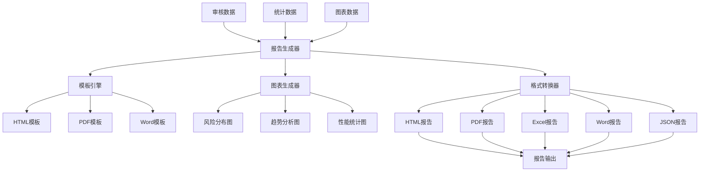

# S10: 审核报告自动生成

## 目标
用Jinja2生成标准化审核报告（HTML/PDF/Excel），支持图表和自定义模板，实现专业的报告输出功能。

## 前置条件
- 完成 S9 批量处理功能实现
- 了解模板引擎和报告生成技术
- 熟悉数据可视化基础

## 核心架构设计

### 1. 报告生成架构

#### 1.1 系统架构图


#### 1.2 核心组件设计
- **ReportGenerator**: 报告生成器主类
- **ReportConfig**: 报告配置管理
- **ReportData**: 报告数据模型
- **ChartGenerator**: 图表生成器

## 详细实现

### 1. 报告数据模型

#### 1.1 ReportConfig 类设计

```python
@dataclass
class ReportConfig:
    """报告配置"""
    title: str = "账务审核报告"
    author: str = "Learn Accounting Agent"
    company: str = "示例公司"
    report_period: str = ""
    include_charts: bool = True
    include_details: bool = True
    include_recommendations: bool = True
    language: str = "zh"  # zh, en
    template_dir: str = "templates"
    output_dir: str = "reports"
    chart_style: str = "seaborn"  # seaborn, plotly, matplotlib
    chart_format: str = "png"  # png, svg, pdf
```

#### 1.2 ReportData 类设计

```python
@dataclass
class ReportData:
    """报告数据"""
    summary: Dict[str, Any] = field(default_factory=dict)      # 审核概要
    audit_results: List[Dict[str, Any]] = field(default_factory=list)  # 审核结果
    risk_analysis: Dict[str, Any] = field(default_factory=dict)  # 风险分析
    trend_analysis: Dict[str, Any] = field(default_factory=dict)  # 趋势分析
    recommendations: List[str] = field(default_factory=list)       # 建议措施
    details: pd.DataFrame = field(default_factory=pd.DataFrame)    # 详细记录
    charts: Dict[str, str] = field(default_factory=dict)          # 图表文件路径
```

### 2. 图表生成系统

#### 2.1 ChartGenerator 类设计

```python
class ChartGenerator:
    """图表生成器"""
    
    def __init__(self, config: ReportConfig):
        self.config = config
        self.chart_dir = Path(config.output_dir) / "charts"
        self.chart_dir.mkdir(parents=True, exist_ok=True)
        
    def generate_risk_distribution_chart(self, risk_data: Dict[str, Any]) -> str:
        """生成风险分布图"""
        if not PLOTTING_AVAILABLE:
            return ""
            
        try:
            risk_counts = risk_data.get("risk_distribution", {})
            if not risk_counts:
                return ""
                
            if self.config.chart_style == "plotly":
                return self._generate_plotly_pie_chart(risk_counts, "risk_distribution")
            else:
                return self._generate_matplotlib_pie_chart(risk_counts, "risk_distribution")
                
        except Exception as e:
            logger.error(f"生成风险分布图失败: {e}")
            return ""
```

#### 2.2 多引擎图表支持

```python
def _generate_plotly_pie_chart(self, data: Dict[str, str], chart_name: str) -> str:
    """生成Plotly饼图"""
    fig = go.Figure(data=[go.Pie(
        labels=list(data.keys()),
        values=list(data.values()),
        hole=0.3,
        textinfo='label+percent',
        textfont_size=12
    )])
    
    fig.update_layout(
        title="风险等级分布",
        font=dict(size=12),
        showlegend=True
    )
    
    chart_path = self.chart_dir / f"{chart_name}.{self.config.chart_format}"
    if self.config.chart_format == "html":
        fig.write_html(str(chart_path))
    else:
        fig.write_image(str(chart_path))
        
    return str(chart_path)

def _generate_matplotlib_pie_chart(self, data: Dict[str, str], chart_name: str) -> str:
    """生成Matplotlib饼图"""
    plt.figure(figsize=(8, 6))
    colors = ['#ff9999', '#66b3ff', '#99ff99', '#ffcc99']
    
    plt.pie(
        data.values(),
        labels=data.keys(),
        autopct='%1.1f%%',
        colors=colors[:len(data)],
        startangle=90
    )
    
    plt.title('风险等级分布', fontsize=14, fontweight='bold')
    plt.axis('equal')
    
    chart_path = self.chart_dir / f"{chart_name}.{self.config.chart_format}"
    plt.savefig(chart_path, dpi=300, bbox_inches='tight')
    plt.close()
    
    return str(chart_path)
```

#### 2.3 趋势分析图表

```python
def generate_trend_chart(self, trend_data: Dict[str, Any]) -> str:
    """生成趋势图"""
    if not PLOTTING_AVAILABLE:
        return ""
        
    try:
        daily_trends = trend_data.get("daily_trends", {})
        if not daily_trends:
            return ""
            
        # 转换数据格式
        dates = list(daily_trends.keys())
        total_counts = [daily_trends[date]["total"] for date in dates]
        failed_counts = [daily_trends[date]["failed"] for date in dates]
        
        if self.config.chart_style == "plotly":
            return self._generate_plotly_trend_chart(dates, total_counts, failed_counts)
        else:
            return self._generate_matplotlib_trend_chart(dates, total_counts, failed_counts)
            
    except Exception as e:
        logger.error(f"生成趋势图失败: {e}")
        return ""
```

### 3. 模板引擎系统

#### 3.1 模板环境设置

```python
def _setup_template_environment(self) -> Environment:
    """设置模板环境"""
    template_dir = Path(self.config.template_dir)
    if template_dir.exists():
        loader = FileSystemLoader(str(template_dir))
        env = Environment(loader=loader, autoescape=True)
    else:
        # 使用内置模板
        env = Environment(autoescape=True)
        self._add_builtin_templates(env)
        
    return env

def _add_builtin_templates(self, env: Environment):
    """添加内置模板"""
    # HTML报告模板
    html_template = """
<!DOCTYPE html>
<html lang="zh-CN">
<head>
    <meta charset="UTF-8">
    <meta name="viewport" content="width=device-width, initial-scale=1.0">
    <title>{{ title }}</title>
    <style>
        body { font-family: 'Microsoft YaHei', Arial, sans-serif; margin: 20px; line-height: 1.6; }
        .header { text-align: center; border-bottom: 2px solid #333; padding-bottom: 20px; margin-bottom: 30px; }
        .section { margin-bottom: 30px; }
        .chart { text-align: center; margin: 20px 0; }
        .table { border-collapse: collapse; width: 100%; margin: 20px 0; }
        .table th, .table td { border: 1px solid #ddd; padding: 8px; text-align: left; }
        .table th { background-color: #f2f2f2; font-weight: bold; }
        .risk-high { color: #d32f2f; }
        .risk-medium { color: #f57c00; }
        .risk-low { color: #388e3c; }
        .summary-item { margin: 10px 0; }
        .recommendation { background-color: #e3f2fd; padding: 15px; border-radius: 5px; margin: 10px 0; }
    </style>
</head>
<body>
    <div class="header">
        <h1>{{ title }}</h1>
        <p>生成时间: {{ generation_time }}</p>
        <p>报告期间: {{ report_period }}</p>
    </div>
    
    <div class="section">
        <h2>审核概要</h2>
        <div class="summary-item">
            <strong>总记录数:</strong> {{ summary.total_records | default(0) }}
        </div>
        <div class="summary-item">
            <strong>通过记录数:</strong> {{ summary.passed_records | default(0) }}
        </div>
        <div class="summary-item">
            <strong>失败记录数:</strong> {{ summary.failed_records | default(0) }}
        </div>
        <div class="summary-item">
            <strong>通过率:</strong> {{ "%.2f"|format(summary.pass_rate*100) }}%
        </div>
    </div>
    
    
    <div class="section">
        <h2>风险分布</h2>
        <div class="chart">
            
        </div>
    </div>
    
    
    
    <div class="section">
        <h2>建议措施</h2>
        
        <div class="recommendation">
            {{ loop.index }}. {{ rec }}
        </div>
        
    </div>
    
    
    <div class="section">
        <p><em>报告由 {{ author }} 自动生成</em></p>
    </div>
</body>
</html>
    """
    env.globals['html_template'] = html_template
```

### 4. 多格式报告生成

#### 4.1 HTML报告生成

```python
def generate_html_report(self, data: ReportData) -> str:
    """生成HTML报告"""
    try:
        template = self.template_env.get_template('html_template') if 'html_template' in self.template_env.globals else None
        
        if template is None:
            template = Template(self.template_env.globals['html_template'])
            
        # 准备模板数据
        template_data = {
            'title': self.config.title,
            'author': self.config.author,
            'generation_time': datetime.now().strftime('%Y-%m-%d %H:%M:%S'),
            'report_period': self.config.report_period,
            'summary': data.summary,
            'charts': data.charts,
            'recommendations': data.recommendations,
            'include_details': self.config.include_details,
            'details': data.details.to_dict('records') if not data.details.empty else []
        }
        
        # 渲染模板
        html_content = template.render(**template_data)
        
        # 保存文件
        report_path = Path(self.config.output_dir) / f"audit_report_{datetime.now().strftime('%Y%m%d_%H%M%S')}.html"
        with open(report_path, 'w', encoding='utf-8') as f:
            f.write(html_content)
            
        logger.info(f"HTML报告已生成: {report_path}")
        return str(report_path)
        
    except Exception as e:
        logger.error(f"生成HTML报告失败: {e}")
        raise
```

#### 4.2 PDF报告生成

```python
def generate_pdf_report(self, data: ReportData) -> str:
    """生成PDF报告"""
    if not REPORTLAB_AVAILABLE:
        logger.error("ReportLab未安装，无法生成PDF报告")
        return ""
        
    try:
        report_path = Path(self.config.output_dir) / f"audit_report_{datetime.now().strftime('%Y%m%d_%H%M%S')}.pdf"
        
        # 创建PDF文档
        doc = SimpleDocTemplate(str(report_path), pagesize=A4)
        styles = getSampleStyleSheet()
        story = []
        
        # 标题
        title_style = ParagraphStyle(
            'CustomTitle',
            parent=styles['Heading1'],
            fontSize=18,
            spaceAfter=30,
            alignment=1  # 居中
        )
        story.append(Paragraph(self.config.title, title_style))
        story.append(Spacer(1, 12))
        
        # 报告信息
        info_style = styles['Normal']
        story.append(Paragraph(f"生成时间: {datetime.now().strftime('%Y-%m-%d %H:%M:%S')}", info_style))
        story.append(Paragraph(f"报告期间: {self.config.report_period}", info_style))
        story.append(Spacer(1, 20))
        
        # 审核概要
        story.append(Paragraph("审核概要", styles['Heading2']))
        summary = data.summary
        story.append(Paragraph(f"总记录数: {summary.get('total_records', 0)}", info_style))
        story.append(Paragraph(f"通过记录数: {summary.get('passed_records', 0)}", info_style))
        story.append(Paragraph(f"失败记录数: {summary.get('failed_records', 0)}", info_style))
        story.append(Paragraph(f"通过率: {summary.get('pass_rate', 0):.2%}", info_style))
        story.append(Spacer(1, 20))
        
        # 建议措施
        if data.recommendations:
            story.append(Paragraph("建议措施", styles['Heading2']))
            for i, rec in enumerate(data.recommendations, 1):
                story.append(Paragraph(f"{i}. {rec}", info_style))
            story.append(Spacer(1, 20))
            
        # 详细记录表格
        if self.config.include_details and not data.details.empty:
            story.append(Paragraph("详细记录", styles['Heading2']))
            
            # 准备表格数据
            table_data = [['记录ID', '审核日期', '任务类型', '风险等级', '状态']]
            for _, record in data.details.iterrows():
                table_data.append([
                    str(record.get('record_id', '')),
                    str(record.get('audit_date', '')),
                    str(record.get('task_type', '')),
                    str(record.get('risk_level', '')),
                    '通过' if record.get('passed', False) else '失败'
                ])
            
            # 创建表格
            table = Table(table_data)
            table.setStyle(TableStyle([
                ('BACKGROUND', (0, 0), (-1, 0), colors.grey),
                ('TEXTCOLOR', (0, 0), (-1, 0), colors.whitesmoke),
                ('ALIGN', (0, 0), (-1, -1), 'CENTER'),
                ('FONTNAME', (0, 0), (-1, 0), 'Helvetica-Bold'),
                ('FONTSIZE', (0, 0), (-1, 0), 12),
                ('BOTTOMPADDING', (0, 0), (-1, 0), 12),
                ('BACKGROUND', (0, 1), (-1, -1), colors.beige),
                ('GRID', (0, 0), (-1, -1), 1, colors.black)
            ]))
            
            story.append(table)
            
        # 构建PDF
        doc.build(story)
        
        logger.info(f"PDF报告已生成: {report_path}")
        return str(report_path)
        
    except Exception as e:
        logger.error(f"生成PDF报告失败: {e}")
        raise
```

#### 4.3 Excel报告生成

```python
def generate_excel_report(self, data: ReportData) -> str:
    """生成Excel报告"""
    try:
        report_path = Path(self.config.output_dir) / f"audit_report_{datetime.now().strftime('%Y%m%d_%H%M%S')}.xlsx"
        
        with pd.ExcelWriter(report_path, engine='openpyxl') as writer:
            # 概要表
            summary_df = pd.DataFrame([data.summary])
            summary_df.to_excel(writer, sheet_name='审核概要', index=False)
            
            # 详细记录表
            if not data.details.empty:
                data.details.to_excel(writer, sheet_name='详细记录', index=False)
                
            # 风险分析表
            if data.risk_analysis:
                risk_df = pd.DataFrame([data.risk_analysis])
                risk_df.to_excel(writer, sheet_name='风险分析', index=False)
                
            # 建议措施表
            if data.recommendations:
                rec_df = pd.DataFrame({
                    '序号': range(1, len(data.recommendations) + 1),
                    '建议措施': data.recommendations
                })
                rec_df.to_excel(writer, sheet_name='建议措施', index=False)
                
        logger.info(f"Excel报告已生成: {report_path}")
        return str(report_path)
        
    except Exception as e:
        logger.error(f"生成Excel报告失败: {e}")
        raise
```

### 5. 综合报告生成

#### 5.1 多格式统一接口

```python
def generate_comprehensive_report(self, data: ReportData, formats: List[str] = None) -> Dict[str, str]:
    """生成综合报告（多种格式）"""
    if formats is None:
        formats = ['html', 'excel']
        
    # 生成图表
    if self.config.include_charts:
        self._generate_charts(data)
        
    generated_files = {}
    
    for format_type in formats:
        try:
            if format_type == 'html':
                file_path = self.generate_html_report(data)
            elif format_type == 'pdf':
                file_path = self.generate_pdf_report(data)
            elif format_type == 'word':
                file_path = self.generate_word_report(data)
            elif format_type == 'excel':
                file_path = self.generate_excel_report(data)
            elif format_type == 'json':
                file_path = self.generate_json_report(data)
            else:
                logger.warning(f"不支持的报告格式: {format_type}")
                continue
                
            generated_files[format_type] = file_path
            
        except Exception as e:
            logger.error(f"生成{format_type}格式报告失败: {e}")
            
    return generated_files
```

#### 5.2 图表生成集成

```python
def _generate_charts(self, data: ReportData):
    """生成所有图表"""
    try:
        # 风险分布图
        if data.risk_analysis:
            risk_chart = self.chart_generator.generate_risk_distribution_chart(data.risk_analysis)
            if risk_chart:
                data.charts['risk_distribution'] = risk_chart
                
        # 趋势分析图
        if data.trend_analysis:
            trend_chart = self.chart_generator.generate_trend_chart(data.trend_analysis)
            if trend_chart:
                data.charts['trend_analysis'] = trend_chart
                
        # 任务性能图
        if data.summary and 'task_distribution' in data.summary:
            task_chart = self.chart_generator.generate_task_performance_chart(data.summary)
            if task_chart:
                data.charts['task_performance'] = task_chart
                
    except Exception as e:
        logger.error(f"生成图表失败: {e}")
```

## 使用示例

### 1. 基础报告生成

```python
from agents.utils.report_generator import ReportGenerator, ReportConfig, ReportData, generate_audit_report

# 创建报告配置
config = ReportConfig(
    title="2024年第一季度账务审核报告",
    company="ABC公司",
    report_period="2024年1月1日 - 2024年3月31日",
    include_charts=True,
    include_details=True
)

# 准备报告数据
report_data = ReportData(
    summary={
        "total_records": 10000,
        "passed_records": 8500,
        "failed_records": 1500,
        "pass_rate": 0.85
    },
    risk_analysis={
        "risk_distribution": {
            "low": 7000,
            "medium": 1200,
            "high": 250,
            "critical": 50
        }
    },
    recommendations=[
        "加强大额交易审批流程",
        "完善科目使用规范",
        "定期进行财务人员培训"
    ]
)

# 生成报告
generator = ReportGenerator(config)
reports = generator.generate_comprehensive_report(report_data, ['html', 'pdf', 'excel'])

print("生成的报告:")
for format_type, file_path in reports.items():
    print(f"  {format_type}: {file_path}")
```

### 2. 便捷函数使用

```python
# 使用便捷函数生成报告
audit_data = {
    'summary': {
        'total_records': 5000,
        'passed_records': 4200,
        'failed_records': 800,
        'pass_rate': 0.84
    },
    'risk_analysis': {
        'risk_distribution': {'low': 3500, 'medium': 800, 'high': 600, 'critical': 100}
    },
    'recommendations': [
        "优化审核流程",
        "加强风险控制"
    ],
    'details': [
        {
            'record_id': '001',
            'audit_date': '2024-01-01',
            'task_type': 'rule_check',
            'risk_level': 'medium',
            'passed': False
        }
    ]
}

reports = generate_audit_report(audit_data, formats=['html', 'excel'])
```

### 3. 自定义模板

```python
# 创建自定义模板目录
template_dir = Path("templates")
template_dir.mkdir(exist_ok=True)

# 自定义HTML模板
custom_html = """
<!DOCTYPE html>
<html>
<head>
    <title>{{ company }} - {{ title }}</title>
    <style>
        .company-header { background-color: #007bff; color: white; padding: 20px; text-align: center; }
        .content { margin: 20px; }
        .footer { border-top: 1px solid #ccc; padding: 10px; text-align: center; }
    </style>
</head>
<body>
    <div class="company-header">
        <h1>{{ company }}</h1>
        <h2>{{ title }}</h2>
    </div>
    <div class="content">
        <h3>审核概要</h3>
        <p>总记录数: {{ summary.total_records }}</p>
        <p>通过率: {{ "%.2f"|format(summary.pass_rate*100) }}%</p>
    </div>
    <div class="footer">
        <p>报告生成时间: {{ generation_time }}</p>
    </div>
</body>
</html>
"""

with open(template_dir / "custom_report.html", 'w', encoding='utf-8') as f:
    f.write(custom_html)

# 使用自定义模板
config = ReportConfig(template_dir="templates")
generator = ReportGenerator(config)
html_report = generator.generate_html_report(report_data)
```

## 测试验证

### 1. 单元测试

```python
def test_report_generation():
    """测试报告生成"""
    config = ReportConfig(title="测试报告")
    generator = ReportGenerator(config)
    
    data = ReportData(
        summary={"total_records": 100, "passed_records": 80, "pass_rate": 0.8},
        recommendations=["建议1", "建议2"]
    )
    
    # 测试HTML生成
    html_path = generator.generate_html_report(data)
    assert Path(html_path).exists()
    
    # 测试Excel生成
    excel_path = generator.generate_excel_report(data)
    assert Path(excel_path).exists()

def test_chart_generation():
    """测试图表生成"""
    config = ReportConfig()
    generator = ReportGenerator(config)
    
    risk_data = {"risk_distribution": {"low": 50, "medium": 30, "high": 20}}
    chart_path = generator.chart_generator.generate_risk_distribution_chart(risk_data)
    
    if PLOTTING_AVAILABLE:
        assert Path(chart_path).exists()
```

## 常见问题

### Q1: 如何处理中文字体问题？
**解决方案**: 
- 设置matplotlib中文字体
- 使用支持中文的模板
- 确保文件编码为UTF-8

### Q2: 如何优化报告生成性能？
**解决方案**: 
- 使用缓存机制
- 异步生成图表
- 分批处理大数据

### Q3: 如何自定义报告样式？
**解决方案**: 
- 修改CSS样式
- 创建自定义模板
- 使用主题配置

### Q4: 如何处理大数据量报告？
**解决方案**: 
- 分页显示详细记录
- 使用数据汇总
- 提供下载链接

## 扩展功能

### 1. 报告模板系统

```python
class TemplateManager:
    """模板管理器"""
    
    def __init__(self, template_dir: str):
        self.template_dir = Path(template_dir)
        self.templates = self._load_templates()
        
    def _load_templates(self) -> Dict[str, Template]:
        """加载所有模板"""
        templates = {}
        for template_file in self.template_dir.glob("*.html"):
            template_name = template_file.stem
            with open(template_file, 'r', encoding='utf-8') as f:
                template_content = f.read()
            templates[template_name] = Template(template_content)
        return templates
```

### 2. 报告调度系统

```python
class ReportScheduler:
    """报告调度器"""
    
    def __init__(self):
        self.scheduled_reports = []
        
    def schedule_report(self, report_config: ReportConfig, 
                       schedule: str,  # daily, weekly, monthly
                       recipients: List[str]):
        """调度报告生成"""
        schedule_info = {
            'config': report_config,
            'schedule': schedule,
            'recipients': recipients,
            'next_run': self._calculate_next_run(schedule)
        }
        self.scheduled_reports.append(schedule_info)
```

## 下一步
完成报告生成后，继续进行 **S11: REST API开发**，实现Web服务接口功能。
