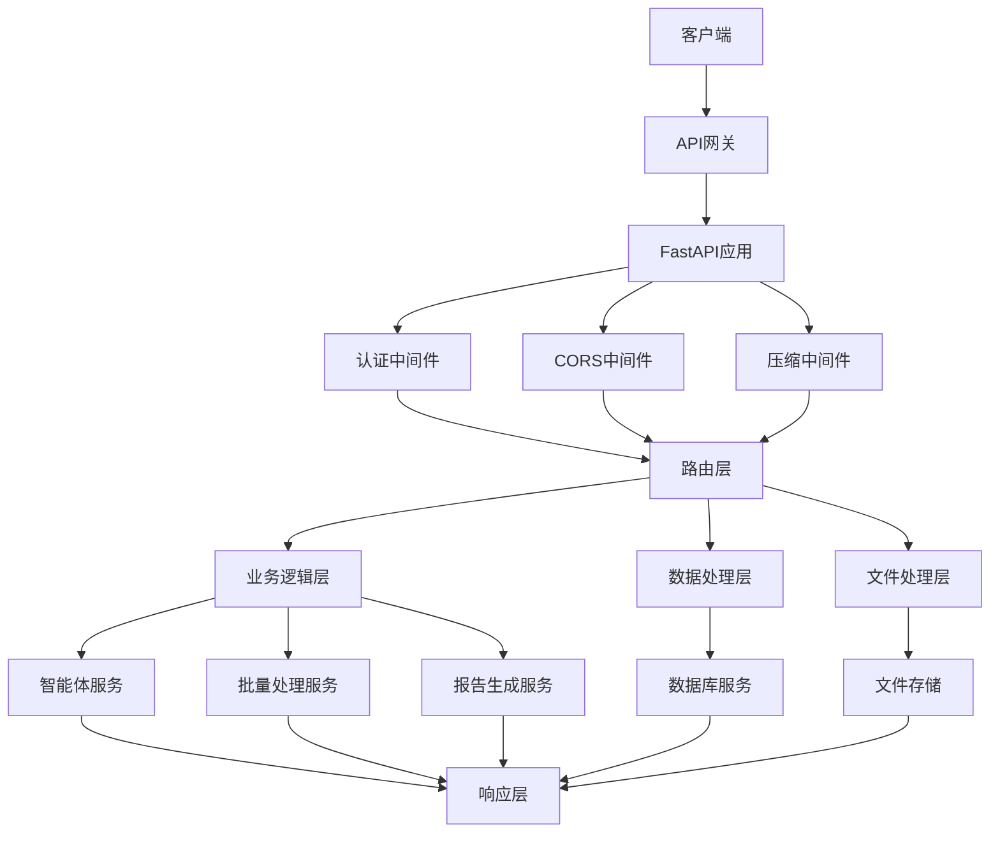

# S11: REST API开发

## 目标
用FastAPI搭建Web服务，提供文件上传、批量审核、报告下载等RESTful接口，实现系统对外服务能力。

## 前置条件
- 完成 S10 报告自动生成实现
- 了解RESTful API设计原则
- 熟悉FastAPI框架使用

## 核心架构设计

### 1. API架构设计

#### 1.1 系统架构图


#### 1.2 核心组件设计
- **FastAPI应用**: 主应用和路由配置
- **中间件系统**: 认证、CORS、压缩等
- **Pydantic模型**: 请求/响应数据验证
- **业务服务**: 智能体、批量处理、报告生成
- **异常处理**: 统一错误处理机制

## 详细实现

### 1. FastAPI应用初始化

#### 1.1 主应用配置

```python
from fastapi import FastAPI, HTTPException
from fastapi.middleware.cors import CORSMiddleware
from fastapi.middleware.gzip import GZipMiddleware
from fastapi.security import HTTPBearer
import logging

# 创建FastAPI应用
app = FastAPI(
    title="Learn Accounting Agent API",
    description="智能账务审核系统API",
    version="1.0.0",
    docs_url="/docs",
    redoc_url="/redoc"
)

# 添加中间件
app.add_middleware(
    CORSMiddleware,
    allow_origins=["*"],  # 生产环境中应该限制具体域名
    allow_credentials=True,
    allow_methods=["*"],
    allow_headers=["*"],
)
app.add_middleware(GZipMiddleware, minimum_size=1000)

# 安全认证
security = HTTPBearer(auto_error=False)
```

#### 1.2 应用生命周期管理

```python
@app.on_event("startup")
async def startup_event():
    """应用启动事件"""
    logger.info("Learn Accounting Agent API 启动中...")
    
    # 创建必要的目录
    os.makedirs("uploads", exist_ok=True)
    os.makedirs("reports", exist_ok=True)
    os.makedirs("batch_results", exist_ok=True)
    
    # 初始化智能体
    global agent_instance
    agent_instance = AccountingAgent()
    agent_instance.register_skill("data_parse", parse_account_data)
    agent_instance.register_skill("rule_check", rule_check_skill)
    agent_instance.register_skill("anomaly_detect", anomaly_detect_skill)
    agent_instance.register_skill("llm_explain", llm_explain_skill)
    
    logger.info("API 启动完成")


@app.on_event("shutdown")
async def shutdown_event():
    """应用关闭事件"""
    logger.info("API 正在关闭...")
```

### 2. 数据模型定义

#### 2.1 请求模型

```python
from pydantic import BaseModel, Field
from typing import List, Dict, Any, Optional
from datetime import datetime

class AuditRequest(BaseModel):
    """审核请求模型"""
    task_type: str = Field(..., description="任务类型", example="rule_check")
    config: Optional[Dict[str, Any]] = Field(None, description="任务配置")
    options: Optional[Dict[str, Any]] = Field(None, description="额外选项")

class BatchAuditRequest(BaseModel):
    """批量审核请求模型"""
    task_types: List[str] = Field(..., description="任务类型列表", example=["rule_check", "anomaly_detect"])
    batch_config: Optional[Dict[str, Any]] = Field(None, description="批量处理配置")
    notification_url: Optional[str] = Field(None, description="完成通知URL")

class ReportRequest(BaseModel):
    """报告生成请求模型"""
    report_config: Optional[Dict[str, Any]] = Field(None, description="报告配置")
    formats: List[str] = Field(default=["html", "excel"], description="报告格式列表")
    data_filter: Optional[Dict[str, Any]] = Field(None, description="数据过滤条件")
```

#### 2.2 响应模型

```python
class ApiResponse(BaseModel):
    """API响应模型"""
    success: bool = Field(..., description="是否成功")
    message: str = Field(..., description="响应消息")
    data: Optional[Any] = Field(None, description="响应数据")
    timestamp: datetime = Field(default_factory=datetime.now, description="响应时间")

class TaskStatus(BaseModel):
    """任务状态模型"""
    task_id: str = Field(..., description="任务ID")
    status: str = Field(..., description="任务状态")
    progress: Optional[float] = Field(None, description="进度百分比")
    start_time: datetime = Field(..., description="开始时间")
    end_time: Optional[datetime] = Field(None, description="结束时间")
    result: Optional[Dict[str, Any]] = Field(None, description="任务结果")
    error: Optional[str] = Field(None, description="错误信息")
```

### 3. 核心API端点

#### 3.1 系统管理接口

```python
@app.get("/", response_model=ApiResponse)
async def root():
    """根路径"""
    return create_response(
        success=True,
        message="Learn Accounting Agent API is running",
        data={
            "version": "1.0.0",
            "docs": "/docs",
            "health": "/health"
        }
    )

@app.get("/health", response_model=ApiResponse)
async def health_check():
    """健康检查"""
    try:
        # 检查数据库连接
        audit_manager = get_audit_record_manager()
        stats = audit_manager.get_audit_statistics()
        
        return create_response(
            success=True,
            message="系统运行正常",
            data={
                "status": "healthy",
                "database": "connected",
                "total_records": stats.get("total_records", 0)
            }
        )
    except Exception as e:
        logger.error(f"健康检查失败: {e}")
        return create_response(
            success=False,
            message=f"系统异常: {str(e)}",
            data={"status": "unhealthy"}
        )
```

#### 3.2 文件管理接口

```python
@app.post("/api/v1/upload", response_model=ApiResponse)
async def upload_file(file: UploadFile = File(...)):
    """上传文件"""
    try:
        # 检查文件类型
        allowed_extensions = ['.xlsx', '.xls', '.csv', '.json']
        file_extension = Path(file.filename).suffix.lower()
        
        if file_extension not in allowed_extensions:
            raise HTTPException(
                status_code=400,
                detail=f"不支持的文件类型: {file_extension}"
            )
        
        # 保存文件
        file_id = str(uuid.uuid4())
        file_path = Path("uploads") / f"{file_id}{file_extension}"
        
        with open(file_path, "wb") as buffer:
            content = await file.read()
            buffer.write(content)
        
        logger.info(f"文件上传成功: {file.filename} -> {file_path}")
        
        return create_response(
            success=True,
            message="文件上传成功",
            data={
                "file_id": file_id,
                "original_name": file.filename,
                "file_path": str(file_path),
                "file_size": len(content)
            }
        )
        
    except Exception as e:
        logger.error(f"文件上传失败: {e}")
        raise HTTPException(status_code=500, detail=f"文件上传失败: {str(e)}")
```

#### 3.3 审核任务接口

```python
@app.post("/api/v1/audit/single", response_model=ApiResponse)
async def audit_single_file(
    file_id: str = Body(..., description="文件ID"),
    audit_request: AuditRequest = Body(...),
    token: HTTPAuthorizationCredentials = Depends(verify_token)
):
    """单文件审核"""
    try:
        # 查找文件
        file_path = None
        for ext in ['.xlsx', '.xls', '.csv', '.json']:
            potential_path = Path("uploads") / f"{file_id}{ext}"
            if potential_path.exists():
                file_path = potential_path
                break
        
        if not file_path:
            raise HTTPException(status_code=404, detail="文件不存在")
        
        # 获取智能体
        agent = get_agent()
        
        # 解析数据
        logger.info(f"开始解析文件: {file_path}")
        data = parse_account_data(str(file_path))
        
        # 执行审核任务
        logger.info(f"执行审核任务: {audit_request.task_type}")
        result = agent.run(audit_request.task_type, data, **(audit_request.config or {}))
        
        # 保存审核记录
        from agents.utils.db import AuditRecord, save_audit_record
        audit_record = AuditRecord(
            record_id=file_id,
            task_type=audit_request.task_type,
            data_source=str(file_path),
            passed=getattr(result, 'passed', True),
            risk_level=getattr(result, 'risk_level', 'low'),
            rule_results=getattr(result, 'rule_results', []),
            anomaly_results=getattr(result, 'anomaly_results', []),
            explanation=getattr(result, 'explanation', None),
            suggestions=getattr(result, 'suggestions', [])
        )
        
        record_id = save_audit_record(audit_record)
        
        return create_response(
            success=True,
            message="审核完成",
            data={
                "record_id": record_id,
                "task_type": audit_request.task_type,
                "result": result,
                "data_summary": {
                    "total_records": len(data),
                    "columns": list(data.columns)
                }
            }
        )
        
    except Exception as e:
        logger.error(f"单文件审核失败: {e}")
        raise HTTPException(status_code=500, detail=f"审核失败: {str(e)}")
```

#### 3.4 批量处理接口

```python
@app.post("/api/v1/audit/batch", response_model=ApiResponse)
async def audit_batch_files(
    background_tasks: BackgroundTasks,
    file_id: str = Body(..., description="文件ID"),
    batch_request: BatchAuditRequest = Body(...),
    token: HTTPAuthorizationCredentials = Depends(verify_token)
):
    """批量文件审核"""
    try:
        # 查找文件
        file_path = None
        for ext in ['.xlsx', '.xls', '.csv', '.json']:
            potential_path = Path("uploads") / f"{file_id}{ext}"
            if potential_path.exists():
                file_path = potential_path
                break
        
        if not file_path:
            raise HTTPException(status_code=404, detail="文件不存在")
        
        # 创建任务ID
        task_id = str(uuid.uuid4())
        
        # 初始化任务状态
        task_status[task_id] = TaskStatus(
            task_id=task_id,
            status="pending",
            start_time=datetime.now()
        )
        
        # 添加后台任务
        background_tasks.add_task(
            process_batch_audit,
            task_id,
            str(file_path),
            batch_request
        )
        
        return create_response(
            success=True,
            message="批量审核任务已启动",
            data={
                "task_id": task_id,
                "status": "pending",
                "estimated_time": "根据数据量而定"
            }
        )
        
    except Exception as e:
        logger.error(f"批量审核启动失败: {e}")
        raise HTTPException(status_code=500, detail=f"批量审核启动失败: {str(e)}")


async def process_batch_audit(task_id: str, file_path: str, batch_request: BatchAuditRequest):
    """后台批量审核处理"""
    try:
        # 更新任务状态
        task_status[task_id].status = "running"
        
        # 获取智能体
        agent = get_agent()
        
        # 解析数据
        logger.info(f"批量审核开始解析文件: {file_path}")
        data = parse_account_data(file_path)
        
        # 创建批量处理器
        batch_config = BatchConfig(**(batch_request.batch_config or {}))
        processor = BatchProcessor(agent, batch_config)
        
        # 添加进度回调
        def progress_callback(progress):
            task_status[task_id].progress = progress.get_progress_percentage()
            
        processor.add_progress_callback(progress_callback)
        
        # 执行批量处理
        logger.info(f"开始批量处理，任务类型: {batch_request.task_types}")
        result = processor.process_batch_sequential(data, batch_request.task_types)
        
        # 更新任务状态
        task_status[task_id].status = "completed"
        task_status[task_id].end_time = datetime.now()
        task_status[task_id].result = result
        
        # 发送通知（如果提供了通知URL）
        if batch_request.notification_url:
            await send_completion_notification(batch_request.notification_url, task_id, result)
            
        logger.info(f"批量审核任务完成: {task_id}")
        
    except Exception as e:
        logger.error(f"批量审核任务失败: {e}")
        task_status[task_id].status = "failed"
        task_status[task_id].end_time = datetime.now()
        task_status[task_id].error = str(e)
```

#### 3.5 任务管理接口

```python
@app.get("/api/v1/tasks/{task_id}/status", response_model=ApiResponse)
async def get_task_status(task_id: str):
    """获取任务状态"""
    if task_id not in task_status:
        raise HTTPException(status_code=404, detail="任务不存在")
    
    status = task_status[task_id]
    return create_response(
        success=True,
        message="任务状态获取成功",
        data=status.dict()
    )

@app.get("/api/v1/tasks", response_model=ApiResponse)
async def list_tasks(
    status_filter: Optional[str] = Query(None, description="状态过滤"),
    limit: int = Query(10, description="返回数量限制")
):
    """获取任务列表"""
    tasks = []
    
    for task_id, status in task_status.items():
        if status_filter is None or status.status == status_filter:
            tasks.append(status.dict())
    
    # 按开始时间倒序排列
    tasks.sort(key=lambda x: x["start_time"], reverse=True)
    
    return create_response(
        success=True,
        message="任务列表获取成功",
        data={
            "tasks": tasks[:limit],
            "total": len(tasks)
        }
    )
```

#### 3.6 报告生成接口

```python
@app.post("/api/v1/reports/generate", response_model=ApiResponse)
async def generate_report(
    report_request: ReportRequest = Body(...),
    token: HTTPAuthorizationCredentials = Depends(verify_token)
):
    """生成审核报告"""
    try:
        # 获取审核记录管理器
        audit_manager = get_audit_record_manager()
        
        # 应用过滤条件
        start_date = None
        end_date = None
        if report_request.data_filter:
            if "start_date" in report_request.data_filter:
                start_date = datetime.fromisoformat(report_request.data_filter["start_date"])
            if "end_date" in report_request.data_filter:
                end_date = datetime.fromisoformat(report_request.data_filter["end_date"])
        
        # 获取统计数据
        stats = audit_manager.get_audit_statistics(start_date, end_date)
        
        # 获取详细记录
        records = audit_manager.get_audit_records_by_filter(
            start_date=start_date,
            end_date=end_date,
            limit=1000
        )
        
        # 准备报告数据
        from agents.utils.report_generator import ReportData
        report_data = ReportData(
            summary=stats,
            details=pd.DataFrame([record.__dict__ for record in records])
        )
        
        # 生成报告
        report_config = ReportConfig(**(report_request.report_config or {}))
        generator = ReportGenerator(report_config)
        
        reports = generator.generate_comprehensive_report(report_data, report_request.formats)
        
        return create_response(
            success=True,
            message="报告生成成功",
            data={
                "reports": reports,
                "summary": stats
            }
        )
        
    except Exception as e:
        logger.error(f"报告生成失败: {e}")
        raise HTTPException(status_code=500, detail=f"报告生成失败: {str(e)}")


@app.get("/api/v1/reports/{report_id}/download")
async def download_report(report_id: str):
    """下载报告文件"""
    try:
        # 查找报告文件
        report_path = None
        for ext in ['.html', '.pdf', '.xlsx', '.docx', '.json']:
            potential_path = Path("reports") / f"{report_id}{ext}"
            if potential_path.exists():
                report_path = potential_path
                break
        
        if not report_path:
            raise HTTPException(status_code=404, detail="报告文件不存在")
        
        return FileResponse(
            path=str(report_path),
            filename=report_path.name,
            media_type='application/octet-stream'
        )
        
    except Exception as e:
        logger.error(f"报告下载失败: {e}")
        raise HTTPException(status_code=500, detail=f"报告下载失败: {str(e)}")
```

### 4. 认证和安全

#### 4.1 Token验证

```python
async def verify_token(credentials: HTTPAuthorizationCredentials = Depends(security)):
    """验证访问令牌"""
    # 这里可以实现真实的token验证逻辑
    # 目前为了演示，允许所有请求
    if credentials:
        # 验证token格式和有效性
        try:
            # 这里可以添加JWT验证逻辑
            payload = decode_jwt_token(credentials.credentials)
            return payload
        except Exception as e:
            raise HTTPException(
                status_code=401,
                detail="无效的访问令牌",
                headers={"WWW-Authenticate": "Bearer"},
            )
    return None

def decode_jwt_token(token: str) -> Dict[str, Any]:
    """解码JWT令牌"""
    # 这里实现JWT解码逻辑
    # 示例：简单验证
    if token == "demo-token":
        return {"user_id": "demo", "permissions": ["read", "write"]}
    raise ValueError("Invalid token")
```

#### 4.2 权限控制

```python
def require_permission(permission: str):
    """权限控制装饰器"""
    def decorator(func):
        async def wrapper(*args, **kwargs):
            # 获取用户信息
            user_info = kwargs.get('current_user')
            if not user_info or permission not in user_info.get('permissions', []):
                raise HTTPException(
                    status_code=403,
                    detail="权限不足"
                )
            return await func(*args, **kwargs)
        return wrapper
    return decorator
```

### 5. 异常处理

#### 5.1 统一异常处理

```python
@app.exception_handler(HTTPException)
async def http_exception_handler(request, exc):
    """HTTP异常处理"""
    return JSONResponse(
        status_code=exc.status_code,
        content=create_response(
            success=False,
            message=exc.detail,
            data={"status_code": exc.status_code}
        ).dict()
    )

@app.exception_handler(Exception)
async def general_exception_handler(request, exc):
    """通用异常处理"""
    logger.error(f"未处理的异常: {exc}")
    return JSONResponse(
        status_code=500,
        content=create_response(
            success=False,
            message="内部服务器错误",
            data={"error": str(exc)}
        ).dict()
    )
```

#### 5.2 自定义异常

```python
class AccountingAPIException(Exception):
    """自定义API异常"""
    def __init__(self, message: str, status_code: int = 400):
        self.message = message
        self.status_code = status_code
        super().__init__(self.message)

class FileProcessingException(AccountingAPIException):
    """文件处理异常"""
    def __init__(self, message: str):
        super().__init__(message, 400)

class TaskNotFoundException(AccountingAPIException):
    """任务未找到异常"""
    def __init__(self, task_id: str):
        super().__init__(f"任务不存在: {task_id}", 404)
```

### 6. 响应格式标准化

#### 6.1 响应创建函数

```python
def create_response(success: bool, message: str, data: Any = None) -> ApiResponse:
    """创建标准API响应"""
    return ApiResponse(
        success=success,
        message=message,
        data=data,
        timestamp=datetime.now()
    )

def create_paginated_response(items: List[Any], page: int, size: int, total: int):
    """创建分页响应"""
    return create_response(
        success=True,
        message="数据获取成功",
        data={
            "items": items,
            "pagination": {
                "page": page,
                "size": size,
                "total": total,
                "pages": (total + size - 1) // size
            }
        }
    )
```

## 使用示例

### 1. 启动API服务

```bash
# 安装依赖
pip install -r api/requirements.txt

# 启动开发服务器
cd api
python main.py

# 或使用uvicorn
uvicorn main:app --host 0.0.0.0 --port 8000 --reload
```

### 2. API使用示例

```python
import httpx
import json

# API基础URL
BASE_URL = "http://localhost:8000"

# 1. 上传文件
async def upload_file():
    async with httpx.AsyncClient() as client:
        with open("data.xlsx", "rb") as f:
            files = {"file": ("data.xlsx", f, "application/vnd.openxmlformats-officedocument.spreadsheetml.sheet")}
            response = await client.post(f"{BASE_URL}/api/v1/upload", files=files)
            return response.json()

# 2. 单文件审核
async def audit_single_file(file_id):
    async with httpx.AsyncClient() as client:
        audit_data = {
            "file_id": file_id,
            "audit_request": {
                "task_type": "rule_check",
                "config": {"strict_mode": True}
            }
        }
        response = await client.post(
            f"{BASE_URL}/api/v1/audit/single",
            json=audit_data,
            headers={"Authorization": "Bearer demo-token"}
        )
        return response.json()

# 3. 批量审核
async def audit_batch_files(file_id):
    async with httpx.AsyncClient() as client:
        batch_data = {
            "file_id": file_id,
            "batch_request": {
                "task_types": ["rule_check", "anomaly_detect"],
                "batch_config": {
                    "batch_size": 1000,
                    "max_workers": 4
                }
            }
        }
        response = await client.post(
            f"{BASE_URL}/api/v1/audit/batch",
            json=batch_data,
            headers={"Authorization": "Bearer demo-token"}
        )
        return response.json()

# 4. 查询任务状态
async def get_task_status(task_id):
    async with httpx.AsyncClient() as client:
        response = await client.get(
            f"{BASE_URL}/api/v1/tasks/{task_id}/status",
            headers={"Authorization": "Bearer demo-token"}
        )
        return response.json()

# 5. 生成报告
async def generate_report():
    async with httpx.AsyncClient() as client:
        report_data = {
            "report_request": {
                "formats": ["html", "excel"],
                "data_filter": {
                    "start_date": "2024-01-01",
                    "end_date": "2024-12-31"
                }
            }
        }
        response = await client.post(
            f"{BASE_URL}/api/v1/reports/generate",
            json=report_data,
            headers={"Authorization": "Bearer demo-token"}
        )
        return response.json()
```

### 3. 前端集成示例

```javascript
// JavaScript/TypeScript 示例
class AccountingAPIClient {
    constructor(baseURL = 'http://localhost:8000', token = 'demo-token') {
        this.baseURL = baseURL;
        this.token = token;
    }
    
    async uploadFile(file) {
        const formData = new FormData();
        formData.append('file', file);
        
        const response = await fetch(`${this.baseURL}/api/v1/upload`, {
            method: 'POST',
            body: formData
        });
        
        return await response.json();
    }
    
    async auditSingle(fileId, taskType, config = {}) {
        const response = await fetch(`${this.baseURL}/api/v1/audit/single`, {
            method: 'POST',
            headers: {
                'Content-Type': 'application/json',
                'Authorization': `Bearer ${this.token}`
            },
            body: JSON.stringify({
                file_id: fileId,
                audit_request: {
                    task_type: taskType,
                    config: config
                }
            })
        });
        
        return await response.json();
    }
    
    async getTaskStatus(taskId) {
        const response = await fetch(`${this.baseURL}/api/v1/tasks/${taskId}/status`, {
            headers: {
                'Authorization': `Bearer ${this.token}`
            }
        });
        
        return await response.json();
    }
}

// 使用示例
const client = new AccountingAPIClient();

// 上传文件
document.getElementById('upload-form').addEventListener('submit', async (e) => {
    e.preventDefault();
    const fileInput = document.getElementById('file-input');
    const file = fileInput.files[0];
    
    if (file) {
        const result = await client.uploadFile(file);
        console.log('Upload result:', result);
    }
});
```

## 测试验证

### 1. 单元测试

```python
import pytest
from fastapi.testclient import TestClient
from main import app

client = TestClient(app)

def test_root_endpoint():
    """测试根路径"""
    response = client.get("/")
    assert response.status_code == 200
    data = response.json()
    assert data["success"] is True
    assert "version" in data["data"]

def test_health_check():
    """测试健康检查"""
    response = client.get("/health")
    assert response.status_code == 200
    data = response.json()
    assert data["success"] is True

def test_upload_file():
    """测试文件上传"""
    with open("test_data.xlsx", "rb") as f:
        response = client.post(
            "/api/v1/upload",
            files={"file": ("test.xlsx", f, "application/vnd.openxmlformats-officedocument.spreadsheetml.sheet")}
        )
    
    assert response.status_code == 200
    data = response.json()
    assert data["success"] is True
    assert "file_id" in data["data"]
```

### 2. 集成测试

```python
import asyncio
import httpx

async def test_full_workflow():
    """测试完整工作流程"""
    async with httpx.AsyncClient() as client:
        # 1. 上传文件
        with open("sample_data.xlsx", "rb") as f:
            upload_response = await client.post(
                "http://localhost:8000/api/v1/upload",
                files={"file": ("sample.xlsx", f, "application/vnd.openxmlformats-officedocument.spreadsheetml.sheet")}
            )
        
        upload_data = upload_response.json()
        file_id = upload_data["data"]["file_id"]
        
        # 2. 单文件审核
        audit_response = await client.post(
            "http://localhost:8000/api/v1/audit/single",
            json={
                "file_id": file_id,
                "audit_request": {
                    "task_type": "rule_check"
                }
            },
            headers={"Authorization": "Bearer demo-token"}
        )
        
        audit_data = audit_response.json()
        assert audit_data["success"] is True
        
        # 3. 生成报告
        report_response = await client.post(
            "http://localhost:8000/api/v1/reports/generate",
            json={
                "report_request": {
                    "formats": ["html"]
                }
            },
            headers={"Authorization": "Bearer demo-token"}
        )
        
        report_data = report_response.json()
        assert report_data["success"] is True

if __name__ == "__main__":
    asyncio.run(test_full_workflow())
```

## 部署配置

### 1. Docker部署

```dockerfile
# Dockerfile
FROM python:3.11-slim

WORKDIR /app

# 安装系统依赖
RUN apt-get update && apt-get install -y \
    gcc \
    g++ \
    && rm -rf /var/lib/apt/lists/*

# 复制依赖文件
COPY requirements.txt .
RUN pip install --no-cache-dir -r requirements.txt

# 复制应用代码
COPY . .

# 创建必要目录
RUN mkdir -p uploads reports batch_results

# 暴露端口
EXPOSE 8000

# 启动命令
CMD ["uvicorn", "main:app", "--host", "0.0.0.0", "--port", "8000"]
```

```yaml
# docker-compose.yml
version: '3.8'

services:
  api:
    build: .
    ports:
      - "8000:8000"
    volumes:
      - ./uploads:/app/uploads
      - ./reports:/app/reports
      - ./batch_results:/app/batch_results
    environment:
      - DATABASE_URL=sqlite:///./accounting_agent.db
      - OPENAI_API_KEY=${OPENAI_API_KEY}
    restart: unless-stopped
```

### 2. 生产环境配置

```python
# config/production.py
import os

class ProductionConfig:
    # API配置
    API_HOST = os.getenv("API_HOST", "0.0.0.0")
    API_PORT = int(os.getenv("API_PORT", "8000"))
    API_WORKERS = int(os.getenv("API_WORKERS", "4"))
    
    # 安全配置
    SECRET_KEY = os.getenv("SECRET_KEY")
    JWT_ALGORITHM = "HS256"
    JWT_EXPIRE_MINUTES = 30
    
    # 数据库配置
    DATABASE_URL = os.getenv("DATABASE_URL", "sqlite:///accounting_agent.db")
    
    # 文件存储配置
    UPLOAD_DIR = os.getenv("UPLOAD_DIR", "uploads")
    REPORT_DIR = os.getenv("REPORT_DIR", "reports")
    MAX_FILE_SIZE = int(os.getenv("MAX_FILE_SIZE", "100MB"))
    
    # 外部服务配置
    OPENAI_API_KEY = os.getenv("OPENAI_API_KEY")
    NOTIFICATION_SERVICE_URL = os.getenv("NOTIFICATION_SERVICE_URL")
```

## 常见问题

### Q1: 如何处理大文件上传？
**解决方案**: 
- 使用流式上传
- 增加文件大小限制
- 实现分块上传

### Q2: 如何优化API性能？
**解决方案**: 
- 使用异步处理
- 添加缓存机制
- 实现负载均衡

### Q3: 如何保证API安全？
**解决方案**: 
- 实现JWT认证
- 添加请求限流
- 使用HTTPS

### Q4: 如何处理并发请求？
**解决方案**: 
- 使用连接池
- 实现任务队列
- 添加资源锁

## 扩展功能

### 1. WebSocket支持

```python
from fastapi import WebSocket

@app.websocket("/ws/tasks/{task_id}")
async def websocket_task_updates(websocket: WebSocket, task_id: str):
    await websocket.accept()
    
    try:
        while True:
            if task_id in task_status:
                await websocket.send_json(task_status[task_id].dict())
            await asyncio.sleep(1)
    except Exception as e:
        logger.error(f"WebSocket连接错误: {e}")
    finally:
        await websocket.close()
```

### 2. API版本管理

```python
# v2 API示例
@app.post("/api/v2/audit/single")
async def audit_single_file_v2(request: AuditRequestV2):
    """v2版本的审核接口，支持更多功能"""
    # 实现v2功能
    pass
```

## 下一步
完成REST API开发后，继续进行 **S12: 部署和监控**，实现系统的生产环境部署和运行监控。
