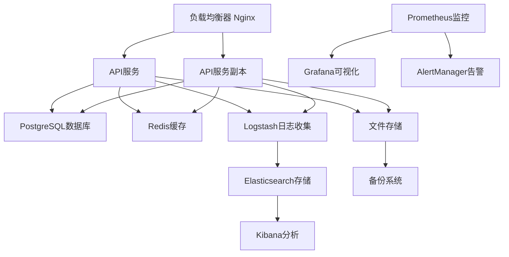

# S12: 部署和监控

## 目标
用Docker部署系统，配置Prometheus+Grafana监控，实现生产环境的稳定运行和实时监控。

## 前置条件
- 完成 S11 REST API开发
- 了解Docker容器化技术
- 熟悉监控系统和运维知识

## 核心架构设计

### 1. 部署架构

#### 1.1 系统架构图


#### 1.2 容器化组件
- **API服务**: FastAPI应用容器
- **数据库**: PostgreSQL容器
- **缓存**: Redis容器
- **代理**: Nginx容器
- **监控**: Prometheus + Grafana容器
- **日志**: ELK Stack容器

## 详细实现

### 1. Docker容器化

#### 1.1 Dockerfile配置

```dockerfile
# 使用Python 3.11官方镜像作为基础镜像
FROM python:3.11-slim

# 设置工作目录
WORKDIR /app

# 设置环境变量
ENV PYTHONDONTWRITEBYTECODE=1 \
    PYTHONUNBUFFERED=1 \
    PIP_NO_CACHE_DIR=1 \
    PIP_DISABLE_PIP_VERSION_CHECK=1

# 安装系统依赖
RUN apt-get update && apt-get install -y \
    gcc \
    g++ \
    curl \
    libpq-dev \
    && rm -rf /var/lib/apt/lists/*

# 复制依赖文件
COPY requirements.txt api/requirements.txt ./

# 安装Python依赖
RUN pip install --upgrade pip && \
    pip install -r requirements.txt && \
    pip install -r api/requirements.txt

# 复制应用代码
COPY . .

# 创建必要的目录
RUN mkdir -p uploads reports batch_results logs static

# 设置权限
RUN chmod +x deployment/entrypoint.sh

# 创建非root用户
RUN useradd --create-home --shell /bin/bash app && \
    chown -R app:app /app
USER app

# 暴露端口
EXPOSE 8000

# 健康检查
HEALTHCHECK --interval=30s --timeout=30s --start-period=5s --retries=3 \
    CMD curl -f http://localhost:8000/health || exit 1

# 启动命令
ENTRYPOINT ["./deployment/entrypoint.sh"]
```

#### 1.2 Docker Compose配置

```yaml
version: '3.8'

services:
  # 主应用服务
  api:
    build: 
      context: ..
      dockerfile: deployment/Dockerfile
    ports:
      - "8000:8000"
    volumes:
      - ./uploads:/app/uploads
      - ./reports:/app/reports
      - ./batch_results:/app/batch_results
      - ./logs:/app/logs
    environment:
      - DATABASE_URL=postgresql://postgres:password@db:5432/accounting_agent
      - REDIS_URL=redis://redis:6379/0
      - OPENAI_API_KEY=${OPENAI_API_KEY}
      - LOG_LEVEL=INFO
      - ENVIRONMENT=production
    depends_on:
      - db
      - redis
    restart: unless-stopped
    networks:
      - accounting-network
    healthcheck:
      test: ["CMD", "curl", "-f", "http://localhost:8000/health"]
      interval: 30s
      timeout: 10s
      retries: 3

  # 数据库服务
  db:
    image: postgres:15-alpine
    environment:
      - POSTGRES_DB=accounting_agent
      - POSTGRES_USER=postgres
      - POSTGRES_PASSWORD=password
    volumes:
      - postgres_data:/var/lib/postgresql/data
      - ./deployment/init.sql:/docker-entrypoint-initdb.d/init.sql
    ports:
      - "5432:5432"
    restart: unless-stopped
    networks:
      - accounting-network
    healthcheck:
      test: ["CMD-SHELL", "pg_isready -U postgres"]
      interval: 10s
      timeout: 5s
      retries: 5

  # Redis缓存服务
  redis:
    image: redis:7-alpine
    ports:
      - "6379:6379"
    volumes:
      - redis_data:/data
      - ./deployment/redis.conf:/usr/local/etc/redis/redis.conf
    command: redis-server /usr/local/etc/redis/redis.conf
    restart: unless-stopped
    networks:
      - accounting-network
    healthcheck:
      test: ["CMD", "redis-cli", "ping"]
      interval: 10s
      timeout: 5s
      retries: 3

  # Nginx反向代理
  nginx:
    image: nginx:alpine
    ports:
      - "80:80"
      - "443:443"
    volumes:
      - ./deployment/nginx.conf:/etc/nginx/nginx.conf
      - ./deployment/ssl:/etc/nginx/ssl
      - ./static:/var/www/static
    depends_on:
      - api
    restart: unless-stopped
    networks:
      - accounting-network

volumes:
  postgres_data:
  redis_data:

networks:
  accounting-network:
    driver: bridge
```

### 2. 启动脚本配置

#### 2.1 entrypoint.sh

```bash
#!/bin/bash

# 启动脚本
set -e

# 等待数据库启动
echo "等待数据库启动..."
while ! nc -z db 5432; do
  sleep 1
done
echo "数据库已启动"

# 等待Redis启动
echo "等待Redis启动..."
while ! nc -z redis 6379; do
  sleep 1
done
echo "Redis已启动"

# 运行数据库迁移
echo "运行数据库迁移..."
python -c "
from agents.utils.db import get_database_manager
db = get_database_manager()
print('数据库初始化完成')
"

# 启动应用
echo "启动应用..."
exec uvicorn api.main:app --host 0.0.0.0 --port 8000 --workers 4
```

#### 2.2 环境变量配置

```bash
# .env.production
# 数据库配置
DATABASE_URL=postgresql://postgres:password@db:5432/accounting_agent
DB_HOST=db
DB_PORT=5432
DB_NAME=accounting_agent
DB_USER=postgres
DB_PASSWORD=password

# Redis配置
REDIS_URL=redis://redis:6379/0
REDIS_HOST=redis
REDIS_PORT=6379

# API配置
API_HOST=0.0.0.0
API_PORT=8000
API_WORKERS=4
SECRET_KEY=your-secret-key-here
JWT_ALGORITHM=HS256
JWT_EXPIRE_MINUTES=30

# 外部服务配置
OPENAI_API_KEY=your-openai-api-key
NOTIFICATION_SERVICE_URL=https://your-notification-service.com/webhook

# 监控配置
METRICS_INTERVAL=30
PROMETHEUS_PORT=8001
ALERT_WEBHOOK_URL=https://your-webhook-url.com/alerts

# 日志配置
LOG_LEVEL=INFO
LOG_FORMAT=json

# 文件存储配置
UPLOAD_DIR=/app/uploads
REPORT_DIR=/app/reports
MAX_FILE_SIZE=100MB
```

### 3. Nginx配置

#### 3.1 nginx.conf

```nginx
events {
    worker_connections 1024;
}

http {
    include       /etc/nginx/mime.types;
    default_type  application/octet-stream;
    
    # 日志格式
    log_format main '$remote_addr - $remote_user [$time_local] "$request" '
                    '$status $body_bytes_sent "$http_referer" '
                    '"$http_user_agent" "$http_x_forwarded_for"';
    
    access_log /var/log/nginx/access.log main;
    error_log /var/log/nginx/error.log;
    
    # 基础配置
    sendfile on;
    tcp_nopush on;
    tcp_nodelay on;
    keepalive_timeout 65;
    types_hash_max_size 2048;
    client_max_body_size 100M;
    
    # Gzip压缩
    gzip on;
    gzip_vary on;
    gzip_min_length 1024;
    gzip_types text/plain text/css text/xml text/javascript 
               application/javascript application/xml+rss 
               application/json application/xml;
    
    # 上游服务器
    upstream api_backend {
        server api:8000;
        keepalive 32;
    }
    
    # HTTP服务器配置
    server {
        listen 80;
        server_name localhost;
        
        # 重定向到HTTPS
        return 301 https://$server_name$request_uri;
    }
    
    # HTTPS服务器配置
    server {
        listen 443 ssl http2;
        server_name localhost;
        
        # SSL配置
        ssl_certificate /etc/nginx/ssl/cert.pem;
        ssl_certificate_key /etc/nginx/ssl/key.pem;
        ssl_protocols TLSv1.2 TLSv1.3;
        ssl_ciphers ECDHE-RSA-AES256-GCM-SHA512:DHE-RSA-AES256-GCM-SHA512;
        ssl_prefer_server_ciphers off;
        
        # 安全头
        add_header X-Frame-Options DENY;
        add_header X-Content-Type-Options nosniff;
        add_header X-XSS-Protection "1; mode=block";
        add_header Strict-Transport-Security "max-age=31536000; includeSubDomains" always;
        
        # API代理
        location /api/ {
            proxy_pass http://api_backend;
            proxy_set_header Host $host;
            proxy_set_header X-Real-IP $remote_addr;
            proxy_set_header X-Forwarded-For $proxy_add_x_forwarded_for;
            proxy_set_header X-Forwarded-Proto $scheme;
            
            # 超时配置
            proxy_connect_timeout 30s;
            proxy_send_timeout 30s;
            proxy_read_timeout 30s;
            
            # 缓冲配置
            proxy_buffering on;
            proxy_buffer_size 4k;
            proxy_buffers 8 4k;
        }
        
        # 文件上传
        location /api/v1/upload {
            proxy_pass http://api_backend;
            proxy_set_header Host $host;
            proxy_set_header X-Real-IP $remote_addr;
            proxy_set_header X-Forwarded-For $proxy_add_x_forwarded_for;
            proxy_set_header X-Forwarded-Proto $scheme;
            
            # 上传特殊配置
            client_max_body_size 100M;
            proxy_request_buffering off;
        }
        
        # 静态文件
        location /static/ {
            alias /var/www/static/;
            expires 1y;
            add_header Cache-Control "public, immutable";
        }
        
        # 健康检查
        location /health {
            proxy_pass http://api_backend;
            access_log off;
        }
        
        # WebSocket支持
        location /ws/ {
            proxy_pass http://api_backend;
            proxy_http_version 1.1;
            proxy_set_header Upgrade $http_upgrade;
            proxy_set_header Connection "upgrade";
            proxy_set_header Host $host;
            proxy_set_header X-Real-IP $remote_addr;
            proxy_set_header X-Forwarded-For $proxy_add_x_forwarded_for;
            proxy_set_header X-Forwarded-Proto $scheme;
        }
    }
}
```

### 4. 监控系统

#### 4.1 Prometheus配置

```yaml
# prometheus.yml
global:
  scrape_interval: 15s
  evaluation_interval: 15s

rule_files:
  - "alert_rules.yml"

alerting:
  alertmanagers:
    - static_configs:
        - targets:
          - alertmanager:9093

scrape_configs:
  - job_name: 'accounting-agent'
    static_configs:
      - targets: ['api:8001']
    metrics_path: '/metrics'
    scrape_interval: 30s

  - job_name: 'node-exporter'
    static_configs:
      - targets: ['node-exporter:9100']

  - job_name: 'postgres-exporter'
    static_configs:
      - targets: ['postgres-exporter:9187']

  - job_name: 'redis-exporter'
    static_configs:
      - targets: ['redis-exporter:9121']
```

#### 4.2 告警规则配置

```yaml
# alert_rules.yml
groups:
  - name: accounting-agent-alerts
    rules:
      - alert: HighCPUUsage
        expr: system_cpu_percent > 80
        for: 5m
        labels:
          severity: warning
        annotations:
          summary: "CPU使用率过高"
          description: "CPU使用率超过80%持续5分钟"

      - alert: HighMemoryUsage
        expr: system_memory_percent > 85
        for: 5m
        labels:
          severity: warning
        annotations:
          summary: "内存使用率过高"
          description: "内存使用率超过85%持续5分钟"

      - alert: HighErrorRate
        expr: rate(http_requests_total{status=~"5.."}[5m]) > 0.05
        for: 2m
        labels:
          severity: critical
        annotations:
          summary: "错误率过高"
          description: "5xx错误率超过5%持续2分钟"

      - alert: DatabaseConnectionFailure
        expr: up{job="postgres-exporter"} == 0
        for: 1m
        labels:
          severity: critical
        annotations:
          summary: "数据库连接失败"
          description: "PostgreSQL数据库无法连接"

      - alert: RedisConnectionFailure
        expr: up{job="redis-exporter"} == 0
        for: 1m
        labels:
          severity: warning
        annotations:
          summary: "Redis连接失败"
          description: "Redis缓存无法连接"
```

#### 4.3 Grafana仪表板配置

```json
{
  "dashboard": {
    "title": "Accounting Agent Dashboard",
    "panels": [
      {
        "title": "系统资源使用率",
        "type": "stat",
        "targets": [
          {
            "expr": "system_cpu_percent",
            "legendFormat": "CPU使用率"
          },
          {
            "expr": "system_memory_percent",
            "legendFormat": "内存使用率"
          },
          {
            "expr": "system_disk_percent",
            "legendFormat": "磁盘使用率"
          }
        ]
      },
      {
        "title": "API请求量",
        "type": "graph",
        "targets": [
          {
            "expr": "rate(http_requests_total[5m])",
            "legendFormat": "请求速率"
          }
        ]
      },
      {
        "title": "响应时间",
        "type": "graph",
        "targets": [
          {
            "expr": "histogram_quantile(0.95, rate(http_request_duration_seconds_bucket[5m]))",
            "legendFormat": "95th百分位响应时间"
          }
        ]
      },
      {
        "title": "活跃任务数",
        "type": "stat",
        "targets": [
          {
            "expr": "active_tasks",
            "legendFormat": "活跃任务"
          }
        ]
      }
    ]
  }
}
```

### 5. 日志管理

#### 5.1 Logstash配置

```ruby
# logstash.conf
input {
  file {
    path => "/var/log/app/*.log"
    start_position => "beginning"
    codec => json
  }
}

filter {
  if [level] == "ERROR" {
    mutate {
      add_tag => ["error"]
    }
  }
  
  date {
    match => [ "timestamp", "ISO8601" ]
  }
  
  mutate {
    remove_field => ["@version", "host", "path"]
  }
}

output {
  elasticsearch {
    hosts => ["elasticsearch:9200"]
    index => "accounting-agent-%{+YYYY.MM.dd}"
  }
  
  if "error" in [tags] {
    http {
      url => "${ALERT_WEBHOOK_URL}"
      http_method => "post"
      format => "json"
      mapping => {
        "message" => "%{message}"
        "level" => "%{level}"
        "timestamp" => "%{timestamp}"
      }
    }
  }
}
```

#### 5.2 应用日志配置

```python
# logging_config.py
import logging
import json
from datetime import datetime

class JSONFormatter(logging.Formatter):
    """JSON格式化器"""
    
    def format(self, record):
        log_entry = {
            "timestamp": datetime.utcnow().isoformat(),
            "level": record.levelname,
            "logger": record.name,
            "message": record.getMessage(),
            "module": record.module,
            "function": record.funcName,
            "line": record.lineno
        }
        
        if hasattr(record, 'request_id'):
            log_entry['request_id'] = record.request_id
            
        if hasattr(record, 'user_id'):
            log_entry['user_id'] = record.user_id
            
        if record.exc_info:
            log_entry['exception'] = self.formatException(record.exc_info)
            
        return json.dumps(log_entry, ensure_ascii=False)

def setup_logging():
    """设置日志配置"""
    # 创建日志目录
    os.makedirs("logs", exist_ok=True)
    
    # 配置根日志器
    logger = logging.getLogger()
    logger.setLevel(logging.INFO)
    
    # 文件处理器
    file_handler = logging.FileHandler("logs/app.log")
    file_handler.setFormatter(JSONFormatter())
    logger.addHandler(file_handler)
    
    # 错误日志文件处理器
    error_handler = logging.FileHandler("logs/error.log")
    error_handler.setLevel(logging.ERROR)
    error_handler.setFormatter(JSONFormatter())
    logger.addHandler(error_handler)
    
    # 控制台处理器
    console_handler = logging.StreamHandler()
    console_handler.setFormatter(
        logging.Formatter('%(asctime)s - %(name)s - %(levelname)s - %(message)s')
    )
    logger.addHandler(console_handler)
```

### 6. 部署脚本

#### 6.1 部署脚本

```bash
#!/bin/bash

# deploy.sh
set -e

echo "开始部署 Learn Accounting Agent..."

# 检查Docker和Docker Compose
if ! command -v docker &> /dev/null; then
    echo "错误: Docker未安装"
    exit 1
fi

if ! command -v docker-compose &> /dev/null; then
    echo "错误: Docker Compose未安装"
    exit 1
fi

# 创建必要的目录
mkdir -p uploads reports batch_results logs static ssl

# 设置权限
chmod 755 uploads reports batch_results logs static

# 复制配置文件
if [ ! -f .env.production ]; then
    cp deployment/.env.example .env.production
    echo "请编辑 .env.production 文件配置环境变量"
    exit 1
fi

# 构建和启动服务
echo "构建Docker镜像..."
docker-compose build

echo "启动服务..."
docker-compose up -d

# 等待服务启动
echo "等待服务启动..."
sleep 30

# 健康检查
echo "执行健康检查..."
if curl -f http://localhost/health; then
    echo "✅ 部署成功！"
    echo "API地址: http://localhost"
    echo "监控地址: http://localhost:3000 (Grafana)"
    echo "指标地址: http://localhost:9090 (Prometheus)"
else
    echo "❌ 部署失败，请检查日志"
    docker-compose logs
    exit 1
fi

echo "部署完成！"
```

#### 6.2 备份脚本

```bash
#!/bin/bash

# backup.sh
set -e

BACKUP_DIR="/backup/accounting-agent"
DATE=$(date +%Y%m%d_%H%M%S)
BACKUP_FILE="backup_${DATE}.tar.gz"

echo "开始备份..."

# 创建备份目录
mkdir -p $BACKUP_DIR

# 备份数据库
echo "备份数据库..."
docker-compose exec -T db pg_dump -U postgres accounting_agent > $BACKUP_DIR/db_backup_${DATE}.sql

# 备份文件数据
echo "备份文件数据..."
tar -czf $BACKUP_DIR/files_backup_${DATE}.tar.gz uploads reports batch_results

# 备份配置文件
echo "备份配置文件..."
cp .env.production $BACKUP_DIR/env_backup_${DATE}
cp deployment/nginx.conf $BACKUP_DIR/nginx_backup_${DATE}

# 创建完整备份
echo "创建完整备份..."
tar -czf $BACKUP_DIR/$BACKUP_FILE \
    $BACKUP_DIR/db_backup_${DATE}.sql \
    $BACKUP_DIR/files_backup_${DATE}.tar.gz \
    $BACKUP_DIR/env_backup_${DATE} \
    $BACKUP_DIR/nginx_backup_${DATE}

# 清理临时文件
rm $BACKUP_DIR/db_backup_${DATE}.sql
rm $BACKUP_DIR/files_backup_${DATE}.tar.gz
rm $BACKUP_DIR/env_backup_${DATE}
rm $BACKUP_DIR/nginx_backup_${DATE}

# 保留最近7天的备份
find $BACKUP_DIR -name "backup_*.tar.gz" -mtime +7 -delete

echo "备份完成: $BACKUP_DIR/$BACKUP_FILE"
```

## 使用指南

### 1. 快速部署

```bash
# 1. 克隆项目
git clone https://github.com/your-org/learn-accounting-agent.git
cd learn-accounting-agent

# 2. 配置环境变量
cp deployment/.env.example .env.production
# 编辑 .env.production 文件

# 3. 运行部署脚本
chmod +x deployment/deploy.sh
./deployment/deploy.sh
```

### 2. 监控访问

部署完成后，可以通过以下地址访问各个服务：

- **API服务**: http://localhost
- **API文档**: http://localhost/docs
- **Grafana监控**: http://localhost:3000 (admin/admin123)
- **Prometheus指标**: http://localhost:9090
- **Kibana日志**: http://localhost:5601

### 3. 日常运维

```bash
# 查看服务状态
docker-compose ps

# 查看日志
docker-compose logs -f api

# 重启服务
docker-compose restart api

# 备份数据
./deployment/backup.sh

# 更新服务
git pull
docker-compose build
docker-compose up -d
```

## 性能优化

### 1. 数据库优化

```sql
-- 创建索引
CREATE INDEX idx_audit_records_date ON audit_records(audit_date);
CREATE INDEX idx_audit_records_task_type ON audit_records(task_type);
CREATE INDEX idx_audit_records_risk_level ON audit_records(risk_level);

-- 分区表（按月分区）
CREATE TABLE audit_records_y2024m01 PARTITION OF audit_records
FOR VALUES FROM ('2024-01-01') TO ('2024-02-01');
```

### 2. 缓存优化

```python
# Redis缓存配置
REDIS_CONFIG = {
    'host': 'redis',
    'port': 6379,
    'db': 0,
    'decode_responses': True,
    'max_connections': 20,
    'retry_on_timeout': True
}

# 缓存策略
CACHE_TTL = {
    'audit_results': 3600,  # 1小时
    'statistics': 300,      # 5分钟
    'user_sessions': 1800    # 30分钟
}
```

### 3. 应用优化

```python
# 连接池配置
DATABASE_CONFIG = {
    'pool_size': 20,
    'max_overflow': 30,
    'pool_pre_ping': True,
    'pool_recycle': 3600
}

# 异步处理
import asyncio
from concurrent.futures import ThreadPoolExecutor

executor = ThreadPoolExecutor(max_workers=4)

async def process_async_task(task_data):
    loop = asyncio.get_event_loop()
    return await loop.run_in_executor(executor, process_task, task_data)
```

## 故障排除

### 1. 常见问题

**问题**: 容器启动失败
```bash
# 检查日志
docker-compose logs api

# 检查端口占用
netstat -tulpn | grep :8000

# 重新构建
docker-compose build --no-cache
```

**问题**: 数据库连接失败
```bash
# 检查数据库状态
docker-compose exec db pg_isready -U postgres

# 检查网络连接
docker-compose exec api ping db

# 重启数据库
docker-compose restart db
```

**问题**: 内存不足
```bash
# 检查内存使用
docker stats

# 增加swap空间
sudo fallocate -l 2G /swapfile
sudo chmod 600 /swapfile
sudo mkswap /swapfile
sudo swapon /swapfile
```

### 2. 监控告警

设置以下关键指标的告警：

- **系统资源**: CPU > 80%, 内存 > 85%, 磁盘 > 90%
- **应用性能**: 响应时间 > 1s, 错误率 > 5%
- **服务可用性**: 数据库连接失败, Redis连接失败
- **业务指标**: 审核失败率 > 10%, 任务积压 > 100

## 安全配置

### 1. 网络安全

```yaml
# docker-compose.security.yml
version: '3.8'

services:
  api:
    networks:
      - frontend
      - backend
    deploy:
      resources:
        limits:
          cpus: '2.0'
          memory: 2G
        reservations:
          cpus: '1.0'
          memory: 1G

  db:
    networks:
      - backend
    deploy:
      resources:
        limits:
          cpus: '1.0'
          memory: 1G

networks:
  frontend:
    driver: bridge
  backend:
    driver: bridge
    internal: true
```

### 2. 访问控制

```nginx
# 限制API访问频率
limit_req_zone $binary_remote_addr zone=api:10m rate=10r/s;

server {
    location /api/ {
        limit_req zone=api burst=20 nodelay;
        proxy_pass http://api_backend;
    }
}
```

## 扩展功能

### 1. 自动扩缩容

```yaml
# docker-compose.scale.yml
version: '3.8'

services:
  api:
    image: accounting-agent:latest
    deploy:
      replicas: 3
      update_config:
        parallelism: 1
        delay: 10s
      restart_policy:
        condition: on-failure
        delay: 5s
        max_attempts: 3
```

### 2. 蓝绿部署

```bash
# blue-green-deploy.sh
CURRENT_ENV=$(docker-compose ps | grep -c "api")
if [ $CURRENT_ENV -eq 1 ]; then
    echo "当前为蓝环境，部署绿环境"
    docker-compose -f docker-compose.green.yml up -d
    # 健康检查后切换
    # 停止蓝环境
else
    echo "当前为绿环境，部署蓝环境"
    docker-compose -f docker-compose.blue.yml up -d
fi
```

## 下一步
完成部署和监控后，整个Learn Accounting Agent项目已经完全实现，具备了生产环境运行的能力。项目包含了完整的智能审核功能、Web API接口、监控系统和部署方案，可以作为企业级财务审核系统的参考实现。
