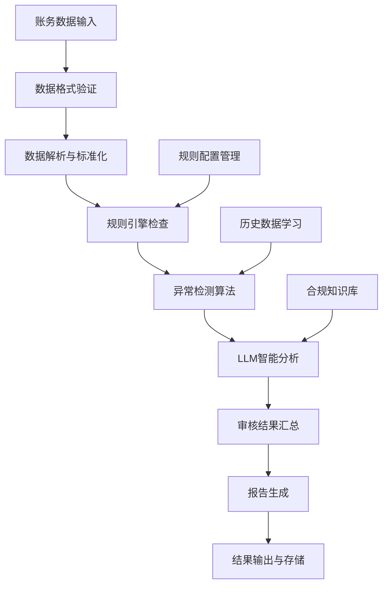

# S2: 账务审核核心场景拆解

## 目标
明确智能体的核心能力边界，拆解账务审核的业务流程，为后续技术实现提供清晰的业务指导。

## 前置条件
- 完成 S1 环境搭建
- 基础会计业务知识了解
- 熟悉企业账务处理流程

## 核心业务场景分析

### 1. 主要应用场景

#### 1.1 单条账务审核
**场景描述**: 对单笔会计分录进行合规性检查
**输入**: 单条会计分录数据
**输出**: 审核结果、异常说明、建议处理方式
**关键检查点**:
- 科目匹配性检查
- 金额合理性验证
- 借贷平衡校验
- 附件完整性检查

#### 1.2 批量账务审核
**场景描述**: 对大量会计分录进行批量自动化审核
**输入**: Excel/CSV格式的账务数据文件
**输出**: 批量审核报告、异常清单、统计汇总
**关键检查点**:
- 批量数据格式验证
- 重复交易检测
- 异常模式识别
- 合规性统计分析

#### 1.3 异常账务标注
**场景描述**: 识别并标注可疑或违规的账务处理
**输入**: 待审核的账务数据
**输出**: 异常标注、风险等级、处理建议
**关键检查点**:
- 异常金额检测
- 违规科目识别
- 时间模式异常
- 关联方交易监控

#### 1.4 审核报告生成
**场景描述**: 自动生成标准化的账务审核报告
**输入**: 审核结果数据
**输出**: Word/PDF格式的审核报告
**关键内容**:
- 审核概况统计
- 异常问题详述
- 风险评估结果
- 改进建议

#### 1.5 审核规则配置
**场景描述**: 灵活配置和管理审核规则
**输入**: 规则配置参数
**输出**: 规则验证结果、配置更新确认
**关键功能**:
- 规则增删改查
- 规则版本管理
- 规则生效时间控制
- 规则优先级设置

### 2. 业务流程图



### 3. 输入输出规范

#### 3.1 输入数据格式

**Excel格式示例**:
| 日期 | 凭证号 | 科目编码 | 科目名称 | 借方金额 | 贷方金额 | 摘要 | 制单人 |
|------|--------|----------|----------|----------|----------|------|--------|
| 2024-01-01 | 记-001 | 1001 | 库存现金 | 10000.00 | | 销售收入 | 张三 |
| 2024-01-01 | 记-001 | 6001 | 主营业务收入 | | 10000.00 | 销售收入 | 张三 |

**JSON格式示例**:
```json
{
  "voucher_id": "记-001",
  "voucher_date": "2024-01-01",
  "entries": [
    {
      "account_code": "1001",
      "account_name": "库存现金",
      "debit_amount": 10000.00,
      "credit_amount": 0,
      "description": "销售收入"
    },
    {
      "account_code": "6001", 
      "account_name": "主营业务收入",
      "debit_amount": 0,
      "credit_amount": 10000.00,
      "description": "销售收入"
    }
  ],
  "creator": "张三"
}
```

#### 3.2 输出结果格式

**审核结果格式**:
```json
{
  "audit_id": "AUDIT_20240101_001",
  "audit_time": "2024-01-01 10:00:00",
  "total_records": 100,
  "passed_records": 85,
  "failed_records": 15,
  "anomaly_summary": {
    "high_risk": 3,
    "medium_risk": 8,
    "low_risk": 4
  },
  "details": [
    {
      "record_id": 1,
      "status": "failed",
      "risk_level": "high",
      "anomalies": [
        "单笔金额超过阈值",
        "科目使用不当"
      ],
      "suggestions": [
        "核实交易真实性",
        "调整科目分类"
      ]
    }
  ]
}
```

### 4. 核心技能清单

#### 4.1 数据解析技能 (Data Parse Skill)
**功能**: 解析多种格式的账务数据
**支持格式**: Excel (.xlsx, .xls), CSV, JSON
**核心能力**:
- 自动字段识别
- 数据类型转换
- 缺失值处理
- 格式标准化

#### 4.2 规则校验技能 (Rule Check Skill)
**功能**: 基于预设规则进行合规性检查
**规则类型**:
- 金额阈值规则
- 科目匹配规则
- 借贷平衡规则
- 时间有效性规则

#### 4.3 异常识别技能 (Anomaly Detection Skill)
**功能**: 使用算法识别异常模式
**检测方法**:
- 统计异常检测
- 模式识别
- 离群值分析
- 时间序列异常

#### 4.4 LLM解释技能 (LLM Explain Skill)
**功能**: 生成自然语言的异常解释
**核心能力**:
- 违规原因分析
- 风险评估说明
- 处理建议生成
- 合规知识引用

#### 4.5 报告生成技能 (Report Generation Skill)
**功能**: 生成标准化审核报告
**报告类型**:
- 详细审核报告
- 异常汇总报告
- 趋势分析报告
- 合规状态报告

### 5. 业务边界与限制

#### 5.1 能力边界
**支持范围**:
- 标准会计分录审核
- 常见违规行为识别
- 基础风险评估
- 标准化报告生成

**不支持范围**:
- 复杂金融衍生品审核
- 跨国税务合规检查
- 管理会计决策支持
- 实时交易监控

#### 5.2 合规要求
**数据安全**:
- 敏感数据脱敏
- 访问权限控制
- 操作日志记录
- 数据加密存储

**审计可追溯**:
- 审核过程记录
- 规则版本管理
- 决策路径保存
- 异常处理追踪

## 验证方式

### 1. 场景理解验证
- 能够描述5个核心业务场景
- 理解输入输出数据格式要求
- 明确各技能的作用和关系

### 2. 流程设计验证
- 绘制完整的业务流程图
- 识别关键决策节点
- 定义异常处理机制

### 3. 边界条件验证
- 明确系统能力边界
- 识别潜在风险点
- 制定应对策略

## 常见问题

### Q1: 如何处理非标准会计科目？
**解决方案**: 建立科目映射表，支持科目别名和自定义科目。

### Q2: 批量审核性能如何保证？
**解决方案**: 采用分块处理、并行计算、缓存优化等技术手段。

### Q3: 审核规则如何更新？
**解决方案**: 设计规则配置界面，支持热更新和版本回滚。

## 下一步
完成业务场景分析后，继续进行 **S3: 智能体基础框架搭建**，实现智能体的核心架构和技能注册机制。
