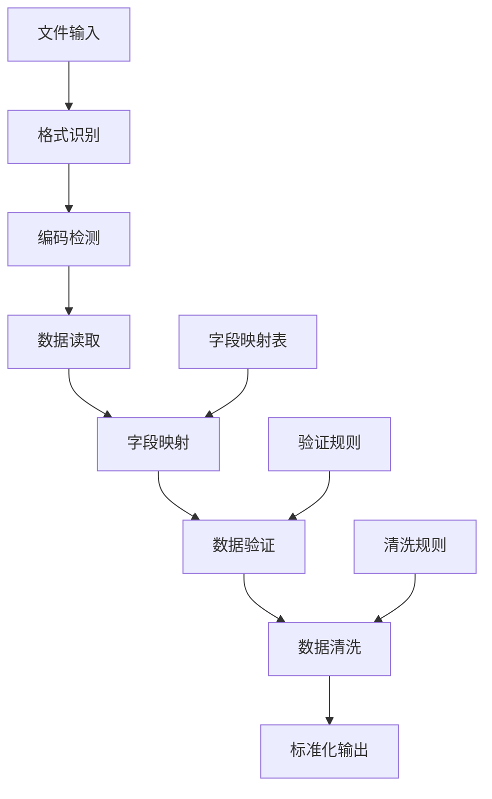

# S4: 账务数据解析技能开发

## 目标
实现账务数据（Excel/CSV/JSON）的解析，转为结构化数据，支持多种格式和字段映射。

## 前置条件
- 完成 S3 智能体基础框架搭建
- 熟悉 pandas 数据处理
- 了解常见财务数据格式

## 核心功能设计

### 1. 数据格式支持

#### 1.1 支持的文件格式
- **Excel格式**: .xlsx, .xls
- **CSV格式**: .csv（支持多种编码）
- **JSON格式**: .json（支持多种结构）

#### 1.2 标准字段映射
```python
REQUIRED_FIELDS = {
    '日期': ['日期', 'date', '交易日期', 'voucher_date', '凭证日期'],
    '科目': ['科目', '科目名称', 'account', 'account_name', '科目编码'],
    '借方金额': ['借方金额', 'debit', 'debit_amount', '借方'],
    '贷方金额': ['贷方金额', 'credit', 'credit_amount', '贷方'],
    '摘要': ['摘要', 'description', 'desc', '备注', 'remark']
}
```

### 2. 解析流程设计

#### 2.1 解析流程图


#### 2.2 核心处理步骤
1. **格式识别**: 根据文件扩展名确定解析方式
2. **编码检测**: 自动检测文件编码（主要针对CSV）
3. **字段映射**: 将各种列名映射到标准字段
4. **数据验证**: 检查必需字段和数据完整性
5. **数据清洗**: 处理空值、格式化日期和金额
6. **标准化输出**: 生成统一格式的DataFrame

## 代码实现详解

### 1. DataParser 类设计

**文件位置**: `skills/impl/data_parse.py`

```python
class DataParser:
    """账务数据解析器"""
    
    def __init__(self, encoding: str = 'utf-8'):
        self.encoding = encoding
        self.field_mapping = {}
        
    def parse_file(self, file_path: str, **kwargs) -> pd.DataFrame:
        """自动识别文件格式并解析"""
        file_path = Path(file_path)
        suffix = file_path.suffix.lower()
        
        if suffix not in self.SUPPORTED_FORMATS:
            raise ValueError(f"不支持的文件格式: {suffix}")
            
        # 根据格式选择解析方法
        format_type = self.SUPPORTED_FORMATS[suffix]
        if format_type == 'excel':
            return self.parse_excel(str(file_path), **kwargs)
        # ... 其他格式
```

**设计特点**:
- **自动格式识别**: 根据文件扩展名自动选择解析方法
- **编码自适应**: 自动检测文件编码，解决中文乱码问题
- **字段映射**: 支持多种列名变体，提高兼容性

### 2. 字段映射机制

```python
def map_columns(self, df: pd.DataFrame) -> pd.DataFrame:
    """映射列名到标准字段名"""
    reverse_mapping = {}
    for standard_name, variants in {**self.REQUIRED_FIELDS, **self.OPTIONAL_FIELDS}.items():
        for variant in variants:
            reverse_mapping[variant.lower()] = standard_name
            
    new_columns = {}
    for col in df.columns:
        col_lower = col.lower().strip()
        if col_lower in reverse_mapping:
            new_columns[col] = reverse_mapping[col_lower]
            self.field_mapping[reverse_mapping[col_lower]] = col
            
    return df.rename(columns=new_columns)
```

**映射优势**:
- **灵活匹配**: 支持中英文列名
- **大小写不敏感**: 统一转换为小写匹配
- **映射记录**: 记录原始列名到标准列名的映射关系

### 3. 数据清洗功能

```python
def clean_data(self, df: pd.DataFrame) -> pd.DataFrame:
    """清洗和标准化数据"""
    df = df.copy()
    
    # 处理日期字段
    if '日期' in df.columns:
        df['日期'] = pd.to_datetime(df['日期'], errors='coerce')
        
    # 处理金额字段
    for amount_field in ['借方金额', '贷方金额']:
        if amount_field in df.columns:
            df[amount_field] = df[amount_field].astype(str).str.replace(r'[^\d.-]', '', regex=True)
            df[amount_field] = pd.to_numeric(df[amount_field], errors='coerce')
            df[amount_field] = df[amount_field].fillna(0)
            
    return df
```

**清洗特性**:
- **日期标准化**: 统一转换为datetime格式
- **金额清理**: 移除非数字字符，处理负数
- **空值处理**: 合理填充默认值

### 4. 多格式解析实现

#### 4.1 Excel解析
```python
def parse_excel(self, file_path: str, **kwargs) -> pd.DataFrame:
    """解析Excel文件"""
    df = pd.read_excel(file_path, **kwargs)
    df = self.map_columns(df)
    self.validate_required_fields(df)
    df = self.clean_data(df)
    return df
```

#### 4.2 CSV解析
```python
def parse_csv(self, file_path: str, **kwargs) -> pd.DataFrame:
    """解析CSV文件"""
    encoding = kwargs.get('encoding') or self.detect_encoding(file_path)
    df = pd.read_csv(file_path, encoding=encoding, **kwargs)
    # 标准化处理...
    return df
```

#### 4.3 JSON解析
```python
def parse_json(self, file_path: str, **kwargs) -> pd.DataFrame:
    """解析JSON文件"""
    with open(file_path, 'r', encoding=self.encoding) as f:
        data = json.load(f)
        
    # 处理不同的JSON结构
    if isinstance(data, list):
        df = pd.DataFrame(data)
    elif isinstance(data, dict):
        if 'data' in data:
            df = pd.DataFrame(data['data'])
        # 其他结构处理...
        
    return df
```

## 技能接口设计

### 1. 主要接口函数

```python
def parse_account_data(file_path: str, **kwargs) -> pd.DataFrame:
    """解析账务数据文件（技能接口）"""
    parser = DataParser()
    return parser.parse_file(file_path, **kwargs)
```

### 2. 验证接口

```python
def validate_data_format(data: Union[pd.DataFrame, str, Path]) -> Dict[str, Any]:
    """验证数据格式"""
    result = {
        "valid": False,
        "errors": [],
        "warnings": [],
        "info": {}
    }
    # 验证逻辑...
    return result
```

## 使用示例

### 1. 基础使用

```python
from skills.impl.data_parse import parse_account_data

# 解析Excel文件
df = parse_account_data("account_data.xlsx")
print(f"解析成功，共 {len(df)} 条记录")

# 解析CSV文件
df = parse_account_data("account_data.csv", encoding='gbk')

# 解析JSON文件
df = parse_account_data("account_data.json")
```

### 2. 高级使用

```python
# 自定义解析参数
df = parse_account_data(
    "account_data.xlsx",
    sheet_name="Sheet1",
    skiprows=1,
    na_values=["NA", "N/A"]
)

# 验证数据格式
from skills.impl.data_parse import validate_data_format

result = validate_data_format("account_data.xlsx")
if result["valid"]:
    print("数据格式正确")
else:
    print("数据格式错误:", result["errors"])
```

### 3. 智能体集成

```python
from agents.accounting_agent import AccountingAgent
from skills.impl.data_parse import parse_account_data

# 创建智能体并注册技能
agent = AccountingAgent()
agent.register_skill("data_parse", parse_account_data)

# 执行数据解析任务
data = agent.run("data_parse", "examples/account_data.xlsx")
print(f"智能体解析完成，数据形状: {data.shape}")
```

## 测试数据示例

### 1. Excel格式示例

| 日期 | 凭证号 | 科目编码 | 科目名称 | 借方金额 | 贷方金额 | 摘要 | 制单人 |
|------|--------|----------|----------|----------|----------|------|--------|
| 2024-01-01 | 记-001 | 1001 | 库存现金 | 10,000.00 | | 销售收入 | 张三 |
| 2024-01-01 | 记-001 | 6001 | 主营业务收入 | | 10,000.00 | 销售收入 | 张三 |

### 2. CSV格式示例
```csv
date,voucher_no,account,debit,credit,description,creator
2024-01-01,记-001,库存现金,10000.00,,销售收入,张三
2024-01-01,记-001,主营业务收入,,10000.00,销售收入,张三
```

### 3. JSON格式示例
```json
{
  "data": [
    {
      "日期": "2024-01-01",
      "凭证号": "记-001",
      "科目": "库存现金",
      "借方金额": 10000.00,
      "贷方金额": 0,
      "摘要": "销售收入",
      "制单人": "张三"
    }
  ]
}
```

## 验证方式

### 1. 功能测试

```python
# test_data_parse.py
def test_parse_excel():
    """测试Excel解析"""
    df = parse_account_data("test_data.xlsx")
    assert len(df) > 0
    assert "日期" in df.columns
    assert "借方金额" in df.columns
    print("✓ Excel解析测试通过")

def test_field_mapping():
    """测试字段映射"""
    parser = DataParser()
    # 模拟不同列名的数据
    df = pd.DataFrame({
        'date': ['2024-01-01'],
        'account': ['库存现金'],
        'debit': [1000],
        'credit': [0],
        'desc': ['测试']
    })
    
    mapped_df = parser.map_columns(df)
    assert "日期" in mapped_df.columns
    assert "科目" in mapped_df.columns
    print("✓ 字段映射测试通过")

if __name__ == "__main__":
    test_parse_excel()
    test_field_mapping()
```

### 2. 性能测试

```python
def test_large_file():
    """测试大文件解析性能"""
    import time
    
    start_time = time.time()
    df = parse_account_data("large_account_data.xlsx")
    end_time = time.time()
    
    print(f"解析 {len(df)} 条记录耗时: {end_time - start_time:.2f} 秒")
    assert end_time - start_time < 30  # 30秒内完成
```

## 常见问题

### Q1: 如何处理中文编码问题？
**解决方案**: 
- 自动检测文件编码
- 支持多种编码格式（utf-8, gbk, gb2312等）
- 提供编码参数覆盖

### Q2: 如何处理不同的列名？
**解决方案**: 
- 建立完整的字段映射表
- 支持中英文列名变体
- 大小写不敏感匹配

### Q3: 如何处理数据格式不一致？
**解决方案**: 
- 智能日期格式识别
- 金额字段自动清理
- 空值和异常值处理

### Q4: 如何处理大文件性能问题？
**解决方案**: 
- 分块读取大文件
- 使用高效的数据类型
- 避免不必要的内存复制

## 扩展功能

### 1. 自定义字段映射
```python
# 添加自定义字段映射
parser = DataParser()
parser.REQUIRED_FIELDS['自定义字段'] = ['自定义', 'custom', '特殊字段']
```

### 2. 数据质量报告
```python
def generate_quality_report(df: pd.DataFrame) -> Dict[str, Any]:
    """生成数据质量报告"""
    report = {
        "total_records": len(df),
        "null_counts": df.isnull().sum().to_dict(),
        "data_types": df.dtypes.to_dict(),
        "duplicates": df.duplicated().sum()
    }
    return report
```

### 3. 批量处理
```python
def batch_parse_files(file_list: List[str]) -> Dict[str, pd.DataFrame]:
    """批量解析多个文件"""
    results = {}
    for file_path in file_list:
        try:
            df = parse_account_data(file_path)
            results[file_path] = df
        except Exception as e:
            print(f"解析文件 {file_path} 失败: {e}")
    return results
```

## 下一步
完成数据解析技能后，继续进行 **S5: 规则引擎（审核规则）实现**，建立可配置的合规检查体系。
