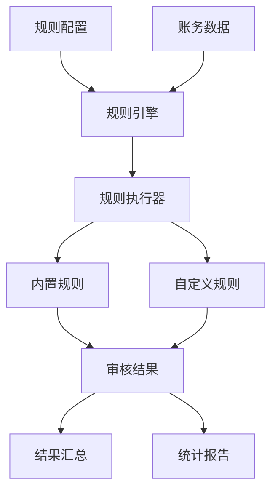

# S5: 规则引擎（审核规则）实现

## 目标
编写可配置的审核规则（如金额阈值、科目匹配、重复交易），建立灵活的合规检查体系。

## 前置条件
- 完成 S4 账务数据解析技能开发
- 熟悉财务审核规则和合规要求
- 了解规则引擎设计模式

## 核心架构设计

### 1. 规则引擎架构

#### 1.1 架构组件


#### 1.2 核心类设计
- **RuleType**: 规则类型枚举
- **RiskLevel**: 风险等级枚举
- **RuleResult**: 单条规则检查结果
- **AuditResult**: 完整审核结果
- **AccountRuleEngine**: 规则引擎主类

### 2. 规则类型体系

#### 2.1 内置规则类型
```python
class RuleType(Enum):
    AMOUNT_THRESHOLD = "amount_threshold"      # 金额阈值检查
    ACCOUNT_VALIDATION = "account_validation"   # 科目有效性验证
    BALANCE_CHECK = "balance_check"            # 借贷平衡检查
    DUPLICATE_CHECK = "duplicate_check"        # 重复交易检查
    DATE_VALIDATION = "date_validation"        # 日期有效性检查
    CUSTOM_RULE = "custom_rule"               # 自定义规则
```

#### 2.2 风险等级体系
```python
class RiskLevel(Enum):
    LOW = "low"           # 低风险
    MEDIUM = "medium"     # 中等风险
    HIGH = "high"         # 高风险
    CRITICAL = "critical" # 严重风险
```

## 详细实现

### 1. 规则结果数据结构

```python
@dataclass
class RuleResult:
    """规则检查结果"""
    rule_name: str                    # 规则名称
    passed: bool                      # 是否通过
    risk_level: RiskLevel            # 风险等级
    message: str                      # 结果消息
    details: Optional[Dict[str, Any]] = None  # 详细信息

@dataclass
class AuditResult:
    """完整审核结果"""
    record_id: Union[int, str]       # 记录ID
    passed: bool                      # 整体是否通过
    risk_level: RiskLevel            # 最高风险等级
    rule_results: List[RuleResult]   # 所有规则结果
    summary: str                      # 审核摘要
    suggestions: List[str]           # 处理建议
```

### 2. 规则引擎核心类

```python
class AccountRuleEngine:
    """账务审核规则引擎"""
    
    def __init__(self, rules: Optional[Dict[str, Any]] = None):
        self.rules = rules or self._get_default_rules()
        self.custom_rules: Dict[str, Callable] = {}
        self.rule_statistics: Dict[str, Dict[str, Any]] = {}
```

**核心特性**:
- **默认规则**: 提供完整的默认规则配置
- **自定义规则**: 支持动态注册自定义规则
- **统计信息**: 记录规则执行统计
- **配置管理**: 支持运行时规则配置更新

### 3. 内置规则实现

#### 3.1 金额阈值检查

```python
def check_amount_threshold(self, record: pd.Series, **kwargs) -> RuleResult:
    """检查金额阈值"""
    rule_config = self.rules["amount_threshold"]
    max_amount = rule_config["max_single_amount"]
    
    debit_amount = record.get("借方金额", 0)
    credit_amount = record.get("贷方金额", 0)
    max_record_amount = max(debit_amount, credit_amount)
    
    if max_record_amount > max_amount:
        return RuleResult(
            "amount_threshold",
            False,
            RiskLevel[rule_config["risk_level"].upper()],
            f"单笔金额 {max_record_amount:.2f} 超过阈值 {max_amount:.2f}",
            {"amount": max_record_amount, "threshold": max_amount}
        )
    
    return RuleResult("amount_threshold", True, RiskLevel.LOW, "金额检查通过")
```

**检查逻辑**:
- 获取借方和贷方金额的最大值
- 与配置的阈值进行比较
- 返回详细的检查结果和风险等级

#### 3.2 科目有效性验证

```python
def check_account_validation(self, record: pd.Series, **kwargs) -> RuleResult:
    """检查科目有效性"""
    account = record.get("科目", "")
    
    # 检查禁用科目
    forbidden_accounts = rule_config["forbidden_accounts"]
    if account in forbidden_accounts:
        return RuleResult("account_validation", False, RiskLevel.HIGH, 
                         f"科目 '{account}' 在禁用列表中")
    
    # 检查科目模式（正则表达式）
    patterns = rule_config.get("account_patterns", {})
    if "allowed" in patterns:
        allowed_patterns = patterns["allowed"]
        if not any(re.match(pattern, str(account)) for pattern in allowed_patterns):
            return RuleResult("account_validation", False, RiskLevel.HIGH,
                             f"科目 '{account}' 不符合允许的模式")
    
    return RuleResult("account_validation", True, RiskLevel.LOW, "科目验证通过")
```

**验证特性**:
- **禁用科目检查**: 检查是否在黑名单中
- **模式验证**: 使用正则表达式验证科目格式
- **灵活配置**: 支持多种验证规则组合

#### 3.3 借贷平衡检查

```python
def check_balance(self, record: pd.Series, **kwargs) -> RuleResult:
    """检查借贷平衡"""
    debit_amount = float(record.get("借方金额", 0))
    credit_amount = float(record.get("贷方金额", 0))
    tolerance = rule_config["tolerance"]
    
    # 检查借贷双方是否都有金额
    if abs(debit_amount) > tolerance and abs(credit_amount) > tolerance:
        return RuleResult("balance_check", False, RiskLevel.HIGH,
                         f"借贷双方都有金额：借方 {debit_amount:.2f}，贷方 {credit_amount:.2f}")
    
    # 检查负金额
    if debit_amount < -tolerance or credit_amount < -tolerance:
        return RuleResult("balance_check", False, RiskLevel.HIGH,
                         f"发现负金额：借方 {debit_amount:.2f}，贷方 {credit_amount:.2f}")
    
    return RuleResult("balance_check", True, RiskLevel.LOW, "借贷平衡检查通过")
```

**平衡检查**:
- **双向金额检查**: 确保借贷双方不都有金额
- **负金额检查**: 检查是否存在负数金额
- **容差处理**: 支持小数精度误差

#### 3.4 重复交易检查

```python
def check_duplicate(self, record: pd.Series, all_records: pd.DataFrame = None, **kwargs) -> RuleResult:
    """检查重复交易"""
    check_fields = rule_config["check_fields"]
    time_window_days = rule_config["time_window_days"]
    
    # 构建检查条件
    conditions = []
    for field in check_fields:
        if field in record and field in all_records.columns:
            conditions.append(all_records[field] == record[field])
    
    # 组合条件并检查时间窗口
    mask = pd.Series([True] * len(all_records))
    for condition in conditions:
        mask = mask & condition
    
    # 排除当前记录
    if hasattr(record, 'name') and record.name is not None:
        mask = mask & (all_records.index != record.name)
    
    duplicate_count = mask.sum()
    
    if duplicate_count > 0:
        return RuleResult("duplicate_check", False, RiskLevel.MEDIUM,
                         f"发现 {duplicate_count} 条重复交易")
    
    return RuleResult("duplicate_check", True, RiskLevel.LOW, "重复检查通过")
```

**重复检测特性**:
- **多字段匹配**: 支持多个字段组合检查
- **时间窗口**: 限制在指定时间范围内检查
- **精确匹配**: 排除当前记录，避免误判

### 4. 自定义规则支持

#### 4.1 规则注册机制

```python
def register_custom_rule(self, rule_name: str, rule_func: Callable, 
                       risk_level: RiskLevel = RiskLevel.MEDIUM,
                       message: str = "自定义规则检查失败"):
    """注册自定义规则"""
    self.custom_rules[rule_name] = {
        "function": rule_func,
        "risk_level": risk_level,
        "message": message
    }
```

#### 4.2 自定义规则示例

```python
# 示例：检查大额现金交易
def check_large_cash_transaction(record: pd.Series, **kwargs) -> RuleResult:
    """检查大额现金交易"""
    account = record.get("科目", "")
    amount = record.get("借方金额", 0) or record.get("贷方金额", 0)
    
    if "现金" in account and amount > 50000:
        return RuleResult(
            "large_cash_transaction",
            False,
            RiskLevel.HIGH,
            f"大额现金交易 {amount:.2f} 超过限制",
            {"account": account, "amount": amount}
        )
    
    return RuleResult("large_cash_transaction", True, RiskLevel.LOW, "现金交易正常")

# 注册自定义规则
engine.register_custom_rule(
    "large_cash_transaction",
    check_large_cash_transaction,
    RiskLevel.HIGH,
    "大额现金交易检查失败"
)
```

### 5. 批量处理机制

```python
def check_batch_records(self, df: pd.DataFrame) -> pd.DataFrame:
    """批量检查记录"""
    results = []
    
    for idx, record in df.iterrows():
        audit_result = self.check_single_record(record, all_records=df)
        results.append(audit_result)
    
    # 将结果添加到原DataFrame
    df["审核结果"] = results
    df["审核通过"] = [result.passed for result in results]
    df["风险等级"] = [result.risk_level.value for result in results]
    df["审核摘要"] = [result.summary for result in results]
    
    return df
```

**批量处理特性**:
- **逐条检查**: 对每条记录执行完整规则检查
- **结果集成**: 将检查结果集成到原数据框
- **性能优化**: 支持大数据集处理

## 配置管理

### 1. 默认规则配置

```python
def _get_default_rules(self) -> Dict[str, Any]:
    """获取默认规则配置"""
    return {
        "amount_threshold": {
            "enabled": True,
            "max_single_amount": 100000,
            "max_daily_amount": 500000,
            "risk_level": "medium",
            "message": "金额超过阈值"
        },
        "account_validation": {
            "enabled": True,
            "forbidden_accounts": ["违规科目1", "违规科目2"],
            "account_patterns": {
                "allowed": [r"^\d{4}$"],
                "forbidden": [r"^[A-Za-z]+$"]
            },
            "risk_level": "high"
        },
        # ... 其他规则配置
    }
```

### 2. 动态配置更新

```python
def update_rule_config(self, rule_name: str, config: Dict[str, Any]):
    """更新规则配置"""
    if rule_name in self.rules:
        self.rules[rule_name].update(config)
        logger.info(f"规则 '{rule_name}' 配置已更新")
```

### 3. 配置示例

```json
{
  "amount_threshold": {
    "enabled": true,
    "max_single_amount": 50000,
    "max_daily_amount": 200000,
    "risk_level": "high"
  },
  "account_validation": {
    "enabled": true,
    "forbidden_accounts": ["私人账户", "个人现金"],
    "account_patterns": {
      "allowed": ["^\\d{4}$", "^\\d{3}-\\d{3}$"],
      "forbidden": ["^[A-Za-z]{3,}$"]
    }
  }
}
```

## 使用示例

### 1. 基础使用

```python
from skills.impl.rule_check import AccountRuleEngine, rule_check_skill

# 使用默认规则
engine = AccountRuleEngine()
result = engine.check_batch_records(df)

# 使用自定义规则
custom_rules = {
    "amount_threshold": {
        "enabled": True,
        "max_single_amount": 50000,
        "risk_level": "high"
    }
}
engine = AccountRuleEngine(custom_rules)
result = engine.check_batch_records(df)
```

### 2. 技能接口使用

```python
# 直接使用技能接口
result = rule_check_skill(df, custom_rules)

# 智能体集成
from agents.accounting_agent import AccountingAgent
agent = AccountingAgent()
agent.register_skill("rule_check", rule_check_skill)
audit_result = agent.run("rule_check", df)
```

### 3. 自定义规则示例

```python
# 定义自定义规则
def check_weekend_transaction(record: pd.Series, **kwargs) -> RuleResult:
    """检查周末交易"""
    date_value = record.get("日期")
    if pd.isna(date_value):
        return RuleResult("weekend_transaction", True, RiskLevel.LOW, "无日期信息")
    
    transaction_date = pd.to_datetime(date_value)
    if transaction_date.dayofweek >= 5:  # 周六、周日
        return RuleResult(
            "weekend_transaction",
            False,
            RiskLevel.MEDIUM,
            f"周末交易日期: {transaction_date.date()}"
        )
    
    return RuleResult("weekend_transaction", True, RiskLevel.LOW, "工作日交易")

# 注册并执行
engine.register_custom_rule("weekend_transaction", check_weekend_transaction)
result = engine.check_batch_records(df)
```

## 统计与监控

### 1. 规则执行统计

```python
def get_rule_statistics(self) -> Dict[str, Any]:
    """获取规则执行统计"""
    stats = {}
    for rule_name, rule_stats in self.rule_statistics.items():
        total = rule_stats["total"]
        failed = rule_stats["failed"]
        stats[rule_name] = {
            "total": total,
            "failed": failed,
            "success_rate": (total - failed) / total if total > 0 else 0
        }
    return stats
```

### 2. 统计报告示例

```python
# 获取统计信息
stats = engine.get_rule_statistics()
print("规则执行统计:")
for rule_name, stat in stats.items():
    print(f"  {rule_name}: {stat['total']} 次, 失败 {stat['failed']} 次, 成功率 {stat['success_rate']:.2%}")
```

## 测试验证

### 1. 单元测试

```python
def test_amount_threshold():
    """测试金额阈值规则"""
    engine = AccountRuleEngine()
    
    # 正常金额
    record = pd.Series({"借方金额": 1000, "科目": "银行存款"})
    result = engine.check_amount_threshold(record)
    assert result.passed == True
    
    # 超过阈值
    record = pd.Series({"借方金额": 200000, "科目": "银行存款"})
    result = engine.check_amount_threshold(record)
    assert result.passed == False
    assert result.risk_level == RiskLevel.MEDIUM

def test_account_validation():
    """测试科目验证规则"""
    engine = AccountRuleEngine()
    
    # 正常科目
    record = pd.Series({"科目": "1001"})
    result = engine.check_account_validation(record)
    assert result.passed == True
    
    # 禁用科目
    record = pd.Series({"科目": "违规科目1"})
    result = engine.check_account_validation(record)
    assert result.passed == False
```

### 2. 集成测试

```python
def test_batch_check():
    """测试批量检查"""
    # 创建测试数据
    test_data = pd.DataFrame([
        {"日期": "2024-01-01", "科目": "1001", "借方金额": 1000, "贷方金额": 0, "摘要": "正常交易"},
        {"日期": "2024-01-02", "科目": "违规科目1", "借方金额": 5000, "贷方金额": 0, "摘要": "违规交易"}
    ])
    
    engine = AccountRuleEngine()
    result = engine.check_batch_records(test_data)
    
    # 验证结果
    assert len(result) == 2
    assert result["审核通过"].iloc[0] == True
    assert result["审核通过"].iloc[1] == False
```

## 常见问题

### Q1: 如何处理规则冲突？
**解决方案**: 
- 定义规则优先级
- 使用风险等级聚合
- 提供冲突解决策略

### Q2: 如何优化大批量数据性能？
**解决方案**: 
- 使用向量化操作
- 分批处理大数据集
- 并行执行独立规则

### Q3: 如何处理规则配置的版本管理？
**解决方案**: 
- 支持配置版本控制
- 提供配置回滚功能
- 记录配置变更历史

## 扩展功能

### 1. 规则链模式
```python
class RuleChain:
    """规则链：按顺序执行规则"""
    def __init__(self):
        self.rules = []
    
    def add_rule(self, rule_func):
        self.rules.append(rule_func)
    
    def execute(self, record):
        for rule in self.rules:
            result = rule(record)
            if not result.passed and result.risk_level == RiskLevel.CRITICAL:
                break  # 严重风险时停止后续检查
        return result
```

### 2. 条件规则
```python
def conditional_rule(condition_func, rule_func):
    """条件规则：满足条件时才执行"""
    def wrapper(record, **kwargs):
        if condition_func(record):
            return rule_func(record, **kwargs)
        return RuleResult("conditional", True, RiskLevel.LOW, "条件不满足，跳过检查")
    return wrapper
```

### 3. 规则模板
```python
def create_threshold_rule(field_name, threshold, risk_level, message):
    """创建阈值规则模板"""
    def rule(record, **kwargs):
        value = record.get(field_name, 0)
        if value > threshold:
            return RuleResult(
                f"{field_name}_threshold",
                False,
                risk_level,
                f"{message}: {value} > {threshold}"
            )
        return RuleResult(f"{field_name}_threshold", True, RiskLevel.LOW, "阈值检查通过")
    return rule
```

## 下一步
完成规则引擎实现后，继续进行 **S6: 异常账务识别逻辑**，实现基于算法的异常检测功能。
