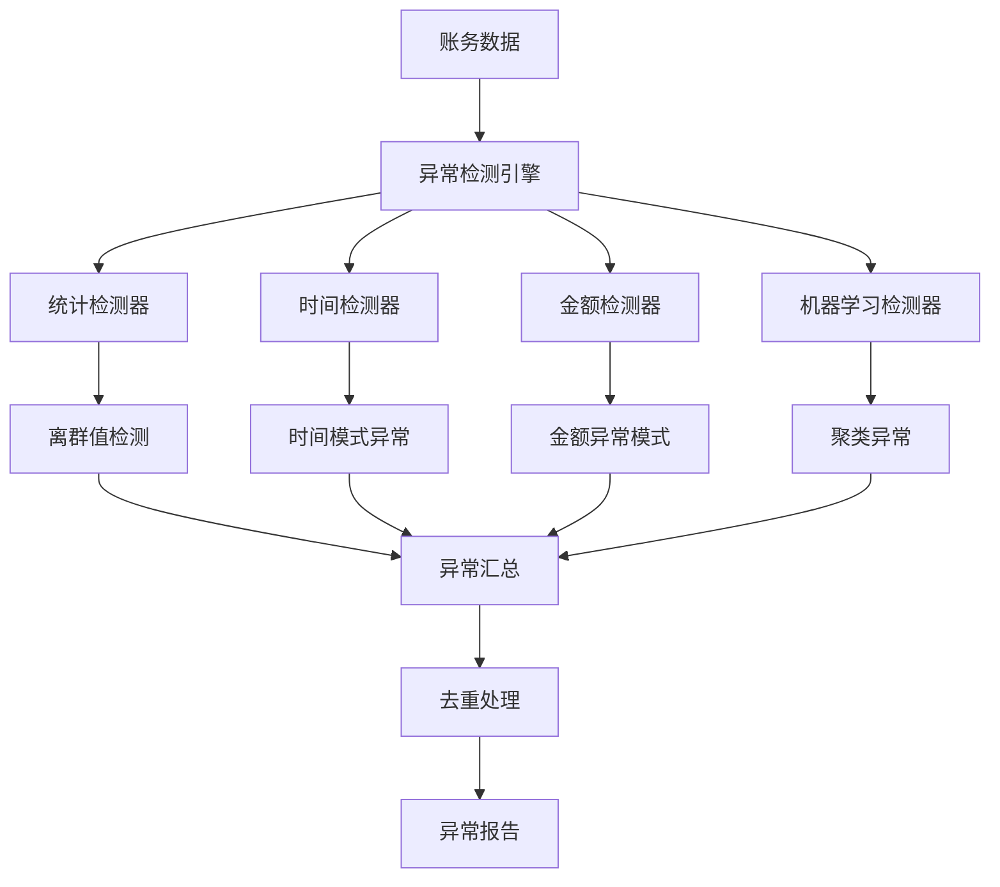

# S6: 异常账务识别逻辑

## 目标
基于规则+简单算法（如离群值检测）增强异常识别，实现多种异常检测算法的组合应用。

## 前置条件
- 完成 S5 规则引擎实现
- 了解统计学异常检测方法
- 熟悉基础机器学习概念

## 核心架构设计

### 1. 异常检测体系架构

#### 1.1 检测器架构


#### 1.2 异常类型分类
```python
class AnomalyType(Enum):
    STATISTICAL_OUTLIER = "statistical_outlier"    # 统计离群值
    TEMPORAL_ANOMALY = "temporal_anomaly"          # 时间异常
    AMOUNT_ANOMALY = "amount_anomaly"              # 金额异常
    FREQUENCY_ANOMALY = "frequency_anomaly"        # 频率异常
    PATTERN_ANOMALY = "pattern_anomaly"            # 模式异常
    CLUSTER_ANOMALY = "cluster_anomaly"            # 聚类异常
```

## 详细实现

### 1. 统计异常检测

#### 1.1 StatisticalDetector 类设计

```python
class StatisticalDetector:
    """统计异常检测器"""
    
    def __init__(self, method: str = "zscore", threshold: float = 2.0):
        self.method = method
        self.threshold = threshold
        
    def detect_outliers(self, data: pd.Series) -> np.ndarray:
        """检测离群值"""
        if self.method == "zscore":
            return self._zscore_detection(data)
        elif self.method == "iqr":
            return self._iqr_detection(data)
        elif self.method == "modified_zscore":
            return self._modified_zscore_detection(data)
```

#### 1.2 检测算法实现

**Z-Score 检测**:
```python
def _zscore_detection(self, data: pd.Series) -> np.ndarray:
    """Z-score检测"""
    z_scores = np.abs((data - data.mean()) / data.std())
    return z_scores > self.threshold
```

**四分位距 (IQR) 检测**:
```python
def _iqr_detection(self, data: pd.Series) -> np.ndarray:
    """四分位距检测"""
    Q1 = data.quantile(0.25)
    Q3 = data.quantile(0.75)
    IQR = Q3 - Q1
    lower_bound = Q1 - 1.5 * IQR
    upper_bound = Q3 + 1.5 * IQR
    return (data < lower_bound) | (data > upper_bound)
```

**修正 Z-Score 检测**:
```python
def _modified_zscore_detection(self, data: pd.Series) -> np.ndarray:
    """修正Z-score检测（基于中位数）"""
    median = np.median(data)
    mad = np.median(np.abs(data - median))
    modified_z_scores = 0.6745 * (data - median) / mad
    return np.abs(modified_z_scores) > self.threshold
```

### 2. 时间异常检测

#### 2.1 TemporalDetector 类设计

```python
class TemporalDetector:
    """时间异常检测器"""
    
    def __init__(self, window_size: int = 7):
        self.window_size = window_size
        
    def detect_temporal_anomalies(self, df: pd.DataFrame) -> List[AnomalyResult]:
        """检测时间异常"""
        anomalies = []
        
        # 检测周末/节假日交易
        weekend_anomalies = self._detect_weekend_transactions(df)
        anomalies.extend(weekend_anomalies)
        
        # 检测异常时间段交易
        time_anomalies = self._detect_abnormal_time_patterns(df)
        anomalies.extend(time_anomalies)
        
        # 检测交易频率异常
        frequency_anomalies = self._detect_frequency_anomalies(df)
        anomalies.extend(frequency_anomalies)
        
        return anomalies
```

#### 2.2 周末交易检测

```python
def _detect_weekend_transactions(self, df: pd.DataFrame) -> List[AnomalyResult]:
    """检测周末交易"""
    anomalies = []
    
    for idx, row in df.iterrows():
        transaction_date = row["日期"]
        if transaction_date.dayofweek >= 5:  # 周六、周日
            severity = AnomalySeverity.MEDIUM
            if transaction_date.dayofweek == 6:  # 周日
                severity = AnomalySeverity.HIGH
                
            anomaly = AnomalyResult(
                record_id=idx,
                anomaly_type=AnomalyType.TEMPORAL_ANOMALY,
                severity=severity,
                score=0.7,
                description=f"周末交易: {transaction_date.strftime('%Y-%m-%d %A')}",
                details={"date": transaction_date, "weekday": transaction_date.strftime('%A')},
                confidence=0.9,
                suggested_action="核实周末交易的必要性"
            )
            anomalies.append(anomaly)
            
    return anomalies
```

#### 2.3 频率异常检测

```python
def _detect_frequency_anomalies(self, df: pd.DataFrame) -> List[AnomalyResult]:
    """检测频率异常"""
    anomalies = []
    
    # 按日期分组统计交易次数
    daily_counts = df.groupby("日期").size()
    
    # 使用IQR方法检测异常日期
    detector = StatisticalDetector(method="iqr", threshold=1.5)
    outlier_mask = detector.detect_outliers(daily_counts)
    
    for date, is_outlier in daily_counts.items():
        if is_outlier:
            count = daily_counts[date]
            anomaly = AnomalyResult(
                record_id=f"date_{date.strftime('%Y%m%d')}",
                anomaly_type=AnomalyType.FREQUENCY_ANOMALY,
                severity=AnomalySeverity.MEDIUM,
                score=0.6,
                description=f"异常交易频率: {date.strftime('%Y-%m-%d')} 有 {count} 笔交易",
                details={"date": date, "transaction_count": count},
                confidence=0.8,
                suggested_action="检查该日期的批量交易"
            )
            anomalies.append(anomaly)
            
    return anomalies
```

### 3. 金额异常检测

#### 3.1 AmountDetector 类设计

```python
class AmountDetector:
    """金额异常检测器"""
    
    def __init__(self, threshold: float = 2.0):
        self.threshold = threshold
        
    def detect_amount_anomalies(self, df: pd.DataFrame) -> List[AnomalyResult]:
        """检测金额异常"""
        anomalies = []
        
        # 检测借方金额异常
        if "借方金额" in df.columns:
            debit_anomalies = self._detect_amount_outliers(df, "借方金额")
            anomalies.extend(debit_anomalies)
            
        # 检测贷方金额异常
        if "贷方金额" in df.columns:
            credit_anomalies = self._detect_amount_outliers(df, "贷方金额")
            anomalies.extend(credit_anomalies)
            
        # 检测整数金额异常
        integer_anomalies = self._detect_integer_amounts(df)
        anomalies.extend(integer_anomalies)
        
        return anomalies
```

#### 3.2 金额离群值检测

```python
def _detect_amount_outliers(self, df: pd.DataFrame, amount_col: str) -> List[AnomalyResult]:
    """检测金额离群值"""
    anomalies = []
    
    amounts = df[amount_col]
    amounts_positive = amounts[amounts > 0]
    
    if len(amounts_positive) < 3:
        return anomalies
        
    detector = StatisticalDetector(method="iqr", threshold=self.threshold)
    outlier_mask = detector.detect_outliers(amounts_positive)
    
    for idx, is_outlier in amounts_positive.items():
        if is_outlier:
            amount = amounts_positive[idx]
            percentile = (amounts_positive < amount).mean()
            
            severity = AnomalySeverity.HIGH if percentile > 0.95 else AnomalySeverity.MEDIUM
            
            anomaly = AnomalyResult(
                record_id=idx,
                anomaly_type=AnomalyType.AMOUNT_ANOMALY,
                severity=severity,
                score=0.8,
                description=f"金额异常: {amount_col} {amount:.2f} 显著偏离正常范围",
                details={"amount": amount, "field": amount_col, "percentile": percentile},
                confidence=0.85,
                suggested_action="核实大额交易的真实性和合规性"
            )
            anomalies.append(anomaly)
            
    return anomalies
```

#### 3.3 整数金额模式检测

```python
def _detect_integer_amounts(self, df: pd.DataFrame) -> List[AnomalyResult]:
    """检测整数金额异常"""
    anomalies = []
    
    amount_cols = ["借方金额", "贷方金额"]
    for col in amount_cols:
        if col in df.columns:
            amounts = df[col][df[col] > 0]
            integer_amounts = amounts[amounts == amounts.astype(int)]
            
            if len(integer_amounts) > 0:
                integer_ratio = len(integer_amounts) / len(amounts)
                if integer_ratio > 0.8:  # 80%以上是整数
                    for idx, amount in integer_amounts.items():
                        if amount > 10000:  # 大额整数
                            anomaly = AnomalyResult(
                                record_id=idx,
                                anomaly_type=AnomalyType.PATTERN_ANOMALY,
                                severity=AnomalySeverity.LOW,
                                score=0.4,
                                description=f"大额整数金额: {col} {amount:.0f}",
                                details={"amount": amount, "field": col, "integer_ratio": integer_ratio},
                                confidence=0.6,
                                suggested_action="检查整数金额是否经过合理计算"
                            )
                            anomalies.append(anomaly)
                            
    return anomalies
```

### 4. 机器学习异常检测

#### 4.1 MLDetector 类设计

```python
class MLDetector:
    """机器学习异常检测器"""
    
    def __init__(self, method: str = "isolation_forest", contamination: float = 0.1):
        self.method = method
        self.contamination = contamination
        self.scaler = StandardScaler()
        self.model = None
        
    def fit_predict(self, df: pd.DataFrame) -> np.ndarray:
        """训练并预测异常"""
        # 特征工程
        features = self._extract_features(df)
        
        if features is None or len(features) < 2:
            return np.ones(len(df))  # 数据不足，全部标记为正常
            
        # 标准化
        features_scaled = self.scaler.fit_transform(features)
        
        # 训练模型
        if self.method == "isolation_forest":
            self.model = IsolationForest(contamination=self.contamination, random_state=42)
        elif self.method == "dbscan":
            self.model = DBSCAN(eps=0.5, min_samples=5)
            
        # 预测
        predictions = self.model.fit_predict(features_scaled)
        return predictions
```

#### 4.2 特征工程

```python
def _extract_features(self, df: pd.DataFrame) -> Optional[np.ndarray]:
    """提取特征"""
    features_list = []
    
    # 金额特征
    if "借方金额" in df.columns:
        features_list.append(df["借方金额"].fillna(0))
    if "贷方金额" in df.columns:
        features_list.append(df["贷方金额"].fillna(0))
        
    # 时间特征
    if "日期" in df.columns:
        dates = pd.to_datetime(df["日期"])
        features_list.append(dates.dt.dayofweek)  # 星期几
        features_list.append(dates.dt.day)       # 日期
        features_list.append(dates.dt.month)     # 月份
        
    # 科目特征（编码）
    if "科目" in df.columns:
        account_codes = pd.factorize(df["科目"])[0]
        features_list.append(account_codes)
        
    if not features_list:
        return None
        
    return np.column_stack(features_list)
```

### 5. 异常检测引擎

#### 5.1 AnomalyDetector 主类

```python
class AnomalyDetector:
    """异常检测主类"""
    
    def __init__(self, config: Optional[Dict[str, Any]] = None):
        self.config = config or self._get_default_config()
        
        # 初始化各个检测器
        self.statistical_detector = StatisticalDetector(
            method=self.config.get("statistical_method", "zscore"),
            threshold=self.config.get("statistical_threshold", 2.0)
        )
        
        self.temporal_detector = TemporalDetector(
            window_size=self.config.get("temporal_window", 7)
        )
        
        self.amount_detector = AmountDetector(
            threshold=self.config.get("amount_threshold", 2.0)
        )
        
        self.ml_detector = MLDetector(
            method=self.config.get("ml_method", "isolation_forest"),
            contamination=self.config.get("ml_contamination", 0.1)
        )
```

#### 5.2 统一检测接口

```python
def detect_anomalies(self, df: pd.DataFrame) -> AnomalyReport:
    """执行异常检测"""
    start_time = datetime.now()
    all_anomalies = []
    
    # 统计异常检测
    if self.config.get("enable_statistical", True):
        statistical_anomalies = self._detect_statistical_anomalies(df)
        all_anomalies.extend(statistical_anomalies)
        
    # 时间异常检测
    if self.config.get("enable_temporal", True):
        temporal_anomalies = self.temporal_detector.detect_temporal_anomalies(df)
        all_anomalies.extend(temporal_anomalies)
        
    # 金额异常检测
    if self.config.get("enable_amount", True):
        amount_anomalies = self.amount_detector.detect_amount_anomalies(df)
        all_anomalies.extend(amount_anomalies)
        
    # 机器学习异常检测
    if self.config.get("enable_ml", True):
        ml_anomalies = self._detect_ml_anomalies(df)
        all_anomalies.extend(ml_anomalies)
        
    # 去重和汇总
    unique_anomalies = self._deduplicate_anomalies(all_anomalies)
    
    # 生成报告
    report = AnomalyReport(
        total_records=len(df),
        anomaly_count=len(unique_anomalies),
        anomaly_rate=len(unique_anomalies) / len(df) if len(df) > 0 else 0,
        anomalies=unique_anomalies,
        summary=self._generate_summary(unique_anomalies),
        detection_time=datetime.now()
    )
    
    return report
```

#### 5.3 异常去重机制

```python
def _deduplicate_anomalies(self, anomalies: List[AnomalyResult]) -> List[AnomalyResult]:
    """去除重复异常"""
    unique_anomalies = []
    seen = set()
    
    for anomaly in anomalies:
        # 创建唯一标识
        identifier = (anomaly.record_id, anomaly.anomaly_type)
        
        if identifier not in seen:
            seen.add(identifier)
            unique_anomalies.append(anomaly)
        else:
            # 如果已存在，更新严重程度（取最高）
            for existing in unique_anomalies:
                if existing.record_id == anomaly.record_id and existing.anomaly_type == anomaly.anomaly_type:
                    if anomaly.severity.value > existing.severity.value:
                        existing.severity = anomaly.severity
                    break
                    
    return unique_anomalies
```

## 配置管理

### 1. 默认配置

```python
def _get_default_config(self) -> Dict[str, Any]:
    """获取默认配置"""
    return {
        "statistical_method": "zscore",
        "statistical_threshold": 2.0,
        "temporal_window": 7,
        "amount_threshold": 2.0,
        "ml_method": "isolation_forest",
        "ml_contamination": 0.1,
        "enable_statistical": True,
        "enable_temporal": True,
        "enable_amount": True,
        "enable_ml": True
    }
```

### 2. 配置示例

```json
{
  "statistical_method": "iqr",
  "statistical_threshold": 1.5,
  "temporal_window": 14,
  "amount_threshold": 3.0,
  "ml_method": "isolation_forest",
  "ml_contamination": 0.05,
  "enable_statistical": true,
  "enable_temporal": true,
  "enable_amount": true,
  "enable_ml": false
}
```

## 使用示例

### 1. 基础使用

```python
from skills.impl.anomaly_detect import AnomalyDetector, anomaly_detect_skill

# 使用默认配置
detector = AnomalyDetector()
report = detector.detect_anomalies(df)

print(f"总记录数: {report.total_records}")
print(f"异常数量: {report.anomaly_count}")
print(f"异常率: {report.anomaly_rate:.2%}")

# 查看异常详情
for anomaly in report.anomalies[:5]:
    print(f"记录 {anomaly.record_id}: {anomaly.description}")
```

### 2. 自定义配置

```python
# 自定义配置
config = {
    "statistical_method": "iqr",
    "statistical_threshold": 1.5,
    "enable_ml": False  # 禁用机器学习检测
}

detector = AnomalyDetector(config)
report = detector.detect_anomalies(df)
```

### 3. 技能接口使用

```python
# 直接使用技能接口
report = anomaly_detect_skill(df, config)

# 智能体集成
from agents.accounting_agent import AccountingAgent
agent = AccountingAgent()
agent.register_skill("anomaly_detect", anomaly_detect_skill)
result = agent.run("anomaly_detect", df)
```

### 4. 异常报告分析

```python
# 按类型统计
print("异常类型统计:")
for anomaly_type, count in report.summary["by_type"].items():
    print(f"  {anomaly_type}: {count}")

# 按严重程度统计
print("\n严重程度统计:")
for severity, count in report.summary["by_severity"].items():
    print(f"  {severity}: {count}")

# 查看最高分的异常
print("\nTop 10 异常:")
for anomaly in report.summary["top_anomalies"]:
    print(f"  记录 {anomaly['record_id']}: {anomaly['description']} (分数: {anomaly['score']:.2f})")
```

## 测试验证

### 1. 单元测试

```python
def test_statistical_detector():
    """测试统计检测器"""
    detector = StatisticalDetector(method="zscore", threshold=2.0)
    
    # 正常数据
    normal_data = pd.Series([1, 2, 3, 4, 5])
    outliers = detector.detect_outliers(normal_data)
    assert outliers.sum() == 0
    
    # 包含异常值的数据
    data_with_outlier = pd.Series([1, 2, 3, 4, 50])
    outliers = detector.detect_outliers(data_with_outlier)
    assert outliers.sum() > 0

def test_temporal_detector():
    """测试时间检测器"""
    detector = TemporalDetector()
    
    # 创建包含周末的数据
    dates = pd.to_datetime(['2024-01-01', '2024-01-06', '2024-01-07'])  # 周一、周六、周日
    df = pd.DataFrame({"日期": dates, "金额": [100, 200, 300]})
    
    anomalies = detector.detect_temporal_anomalies(df)
    assert len(anomalies) >= 2  # 至少检测到周末交易
```

### 2. 集成测试

```python
def test_anomaly_detection():
    """测试完整异常检测"""
    # 创建测试数据
    test_data = pd.DataFrame({
        "日期": pd.to_datetime(['2024-01-01', '2024-01-02', '2024-01-03', '2024-01-06']),
        "科目": ["1001", "1002", "1001", "1003"],
        "借方金额": [1000, 1500, 2000, 50000],  # 最后一个是异常值
        "贷方金额": [0, 0, 0, 0]
    })
    
    detector = AnomalyDetector()
    report = detector.detect_anomalies(test_data)
    
    # 验证结果
    assert report.total_records == 4
    assert report.anomaly_count > 0
    assert len(report.anomalies) > 0
```

## 性能优化

### 1. 大数据集处理

```python
def detect_anomalies_batch(self, df: pd.DataFrame, batch_size: int = 1000) -> AnomalyReport:
    """分批处理大数据集"""
    all_anomalies = []
    
    for i in range(0, len(df), batch_size):
        batch_df = df.iloc[i:i+batch_size]
        batch_report = self.detect_anomalies(batch_df)
        all_anomalies.extend(batch_report.anomalies)
        
    # 重新汇总报告
    unique_anomalies = self._deduplicate_anomalies(all_anomalies)
    
    return AnomalyReport(
        total_records=len(df),
        anomaly_count=len(unique_anomalies),
        anomaly_rate=len(unique_anomalies) / len(df),
        anomalies=unique_anomalies,
        summary=self._generate_summary(unique_anomalies),
        detection_time=datetime.now()
    )
```

### 2. 并行处理

```python
from concurrent.futures import ThreadPoolExecutor

def detect_anomalies_parallel(self, df: pd.DataFrame, n_workers: int = 4) -> AnomalyReport:
    """并行处理异常检测"""
    chunks = np.array_split(df, n_workers)
    
    with ThreadPoolExecutor(max_workers=n_workers) as executor:
        futures = [executor.submit(self.detect_anomalies, chunk) for chunk in chunks]
        reports = [future.result() for future in futures]
    
    # 合并结果
    all_anomalies = []
    for report in reports:
        all_anomalies.extend(report.anomalies)
        
    unique_anomalies = self._deduplicate_anomalies(all_anomalies)
    
    return AnomalyReport(
        total_records=len(df),
        anomaly_count=len(unique_anomalies),
        anomaly_rate=len(unique_anomalies) / len(df),
        anomalies=unique_anomalies,
        summary=self._generate_summary(unique_anomalies),
        detection_time=datetime.now()
    )
```

## 常见问题

### Q1: 如何调整检测敏感度？
**解决方案**: 
- 调整阈值参数（如 statistical_threshold）
- 修改 contamination 参数控制异常比例
- 根据业务需求调整严重程度判断标准

### Q2: 如何处理误报问题？
**解决方案**: 
- 提高检测阈值
- 增加置信度过滤
- 结合业务规则进行二次验证

### Q3: 如何处理不同类型的数据？
**解决方案**: 
- 使用特征工程适配不同数据类型
- 针对特定场景定制检测器
- 使用集成方法结合多种检测结果

## 扩展功能

### 1. 自定义异常检测器

```python
class CustomAnomalyDetector:
    """自定义异常检测器"""
    
    def detect(self, df: pd.DataFrame) -> List[AnomalyResult]:
        """自定义检测逻辑"""
        anomalies = []
        
        # 实现自定义检测逻辑
        # ...
        
        return anomalies

# 集成到主检测器
detector = AnomalyDetector()
detector.custom_detectors.append(CustomAnomalyDetector())
```

### 2. 异常趋势分析

```python
def analyze_anomaly_trends(self, reports: List[AnomalyReport]) -> Dict[str, Any]:
    """分析异常趋势"""
    trend_data = []
    
    for report in reports:
        trend_data.append({
            "date": report.detection_time.date(),
            "anomaly_count": report.anomaly_count,
            "anomaly_rate": report.anomaly_rate
        })
    
    trend_df = pd.DataFrame(trend_data)
    
    return {
        "daily_trend": trend_df.to_dict("records"),
        "trend_analysis": {
            "increasing_trend": trend_df["anomaly_count"].is_monotonic_increasing,
            "avg_daily_anomalies": trend_df["anomaly_count"].mean(),
            "peak_day": trend_df.loc[trend_df["anomaly_count"].idxmax(), "date"]
        }
    }
```

## 下一步
完成异常检测实现后，继续进行 **S7: LLM集成（智能问答/解释）**，实现基于大语言模型的智能解释功能。
