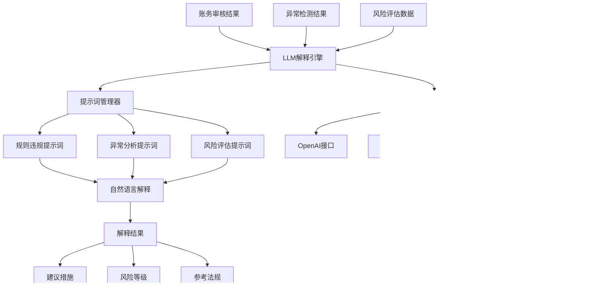

# S7: LLM集成（智能问答/解释）

## 目标
用LangChain调用LLM（如GPT/文心一言），对异常账务生成自然语言解释，提供专业的财务分析和建议。

## 前置条件
- 完成 S6 异常检测算法实现
- 了解大语言模型基本概念
- 熟悉LangChain框架使用

## 核心架构设计

### 1. LLM集成架构

#### 1.1 系统架构图


#### 1.2 核心组件设计
- **LLMExplainer**: LLM解释器主类
- **PromptManager**: 提示词管理器
- **ExplanationResult**: 解释结果数据结构
- **LLMProvider**: LLM提供商适配器

## 详细实现

### 1. 解释类型体系

#### 1.1 解释类型枚举
```python
class ExplanationType(Enum):
    RULE_VIOLATION = "rule_violation"        # 规则违规解释
    ANOMALY_ANALYSIS = "anomaly_analysis"    # 异常分析解释
    RISK_ASSESSMENT = "risk_assessment"      # 风险评估解释
    COMPLIANCE_GUIDANCE = "compliance_guidance" # 合规指导解释
    REMEDIATION_SUGGESTION = "remediation_suggestion" # 整改建议解释
```

#### 1.2 解释结果结构
```python
@dataclass
class ExplanationResult:
    explanation_type: ExplanationType    # 解释类型
    content: str                        # 解释内容
    confidence: float                   # 置信度 (0-1)
    suggestions: List[str]              # 建议列表
    risk_level: str                    # 风险等级
    references: List[str]              # 参考法规或条款
    processing_time: float             # 处理时间（秒）
    token_usage: Optional[Dict[str, int]] = None  # Token使用情况
```

### 2. 提示词管理系统

#### 2.1 PromptManager 类设计

```python
class PromptManager:
    """提示词管理器"""
    
    def __init__(self):
        self.templates = self._initialize_templates()
        
    def _initialize_templates(self) -> Dict[str, Any]:
        """初始化提示词模板"""
        return {
            "rule_violation": {
                "system": """你是一名专业的财务审计专家，具有丰富的会计准则和法规知识。
你的任务是为账务审核中的规则违规提供专业、准确的解释和建议。

请遵循以下原则：
1. 基于会计准则和相关法规进行解释
2. 提供具体的违规原因和影响
3. 给出切实可行的整改建议
4. 语言要专业、准确、易懂
5. 引用相关的会计准则或法规条款""",
                
                "human": """请分析以下账务规则违规情况：

违规信息：
- 规则名称：{rule_name}
- 违规描述：{violation_description}
- 涉及金额：{amount}
- 交易日期：{date}
- 科目：{account}
- 摘要：{description}

请提供：
1. 违规原因分析
2. 潜在风险影响
3. 整改建议
4. 预防措施"""
            }
        }
```

#### 2.2 动态提示词生成

```python
def get_prompt(self, explanation_type: str, context: Dict[str, Any]) -> tuple:
    """获取提示词"""
    if explanation_type not in self.templates:
        raise ValueError(f"不支持的解释类型: {explanation_type}")
        
    template = self.templates[explanation_type]
    system_prompt = template["system"]
    human_prompt = template["human"].format(**context)
    
    return system_prompt, human_prompt
```

### 3. LLM提供商适配

#### 3.1 多提供商支持

```python
class LLMExplainer:
    """LLM解释器主类"""
    
    def _initialize_llm(self):
        """初始化LLM"""
        if not LANGCHAIN_AVAILABLE:
            logger.warning("LangChain不可用，使用模拟LLM")
            return MockLLM()
            
        provider = self.config.get("provider", "openai")
        
        try:
            if provider == "openai":
                api_key = self.config.get("api_key")
                if not api_key:
                    logger.warning("未配置OpenAI API密钥，使用模拟LLM")
                    return MockLLM()
                    
                return ChatOpenAI(
                    model=self.config.get("model", "gpt-3.5-turbo"),
                    temperature=self.config.get("temperature", 0.1),
                    max_tokens=self.config.get("max_tokens", 1000),
                    openai_api_key=api_key
                )
            else:
                logger.warning(f"不支持的LLM提供商: {provider}")
                return MockLLM()
                
        except Exception as e:
            logger.error(f"LLM初始化失败: {e}")
            return MockLLM()
```

#### 3.2 模拟LLM实现

```python
class MockLLM:
    """模拟LLM类，用于测试"""
    
    def __init__(self, **kwargs):
        self.model_name = kwargs.get("model_name", "mock-model")
        
    def __call__(self, prompt: str) -> str:
        """模拟LLM响应"""
        return f"这是模拟LLM的响应。输入提示词长度: {len(prompt)} 字符。"
```

### 4. 核心解释功能

#### 4.1 规则违规解释

```python
def explain_rule_violation(self, rule_result: Dict[str, Any], 
                           record: pd.Series) -> ExplanationResult:
    """解释规则违规"""
    start_time = datetime.now()
    
    context = {
        "rule_name": rule_result.get("rule_name", "未知规则"),
        "violation_description": rule_result.get("message", "违规描述不明确"),
        "amount": record.get("借方金额", 0) or record.get("贷方金额", 0),
        "date": record.get("日期", "未知日期"),
        "account": record.get("科目", "未知科目"),
        "description": record.get("摘要", "无摘要")
    }
    
    system_prompt, human_prompt = self.prompt_manager.get_prompt("rule_violation", context)
    
    try:
        if isinstance(self.llm, MockLLM):
            content = self._generate_mock_rule_violation_explanation(context)
            token_usage = {"prompt_tokens": 100, "completion_tokens": 200, "total_tokens": 300}
        else:
            messages = [
                SystemMessage(content=system_prompt),
                HumanMessage(content=human_prompt)
            ]
            response = self.llm(messages)
            content = response.content
            token_usage = getattr(response, 'usage', None)
            
        # 解析响应
        suggestions = self._extract_suggestions(content)
        references = self._extract_references(content)
        confidence = self._calculate_confidence(content, context)
        
        processing_time = (datetime.now() - start_time).total_seconds()
        
        return ExplanationResult(
            explanation_type=ExplanationType.RULE_VIOLATION,
            content=content,
            confidence=confidence,
            suggestions=suggestions,
            risk_level=rule_result.get("risk_level", "medium"),
            references=references,
            processing_time=processing_time,
            token_usage=token_usage
        )
        
    except Exception as e:
        logger.error(f"规则违规解释失败: {e}")
        return self._create_error_result(e, ExplanationType.RULE_VIOLATION, start_time)
```

#### 4.2 异常分析解释

```python
def explain_anomaly(self, anomaly_result: Dict[str, Any], 
                   context_data: pd.DataFrame) -> ExplanationResult:
    """解释异常检测结果"""
    start_time = datetime.now()
    
    context = {
        "anomaly_type": anomaly_result.get("anomaly_type", "未知类型"),
        "anomaly_description": anomaly_result.get("description", "异常描述不明确"),
        "anomaly_score": anomaly_result.get("score", 0),
        "data_context": self._summarize_context_data(context_data),
        "detection_method": anomaly_result.get("details", {}).get("method", "未知方法")
    }
    
    system_prompt, human_prompt = self.prompt_manager.get_prompt("anomaly_analysis", context)
    
    try:
        if isinstance(self.llm, MockLLM):
            content = self._generate_mock_anomaly_explanation(context)
        else:
            messages = [
                SystemMessage(content=system_prompt),
                HumanMessage(content=human_prompt)
            ]
            response = self.llm(messages)
            content = response.content
            
        # 处理响应...
        return self._process_explanation_result(content, ExplanationType.ANOMALY_ANALYSIS, 
                                              anomaly_result, start_time)
        
    except Exception as e:
        logger.error(f"异常解释失败: {e}")
        return self._create_error_result(e, ExplanationType.ANOMALY_ANALYSIS, start_time)
```

#### 4.3 风险评估生成

```python
def generate_risk_assessment(self, audit_results: List[Dict[str, Any]], 
                              overall_context: Dict[str, Any]) -> ExplanationResult:
    """生成风险评估报告"""
    start_time = datetime.now()
    
    # 汇总风险信息
    risk_summary = self._summarize_risks(audit_results)
    
    context = {
        "risk_type": "综合风险评估",
        "risk_description": f"基于{len(audit_results)}项审核结果的综合风险评估",
        "amount": sum(r.get("amount", 0) for r in audit_results),
        "risk_level": risk_summary["overall_risk"],
        "context_data": json.dumps(overall_context, ensure_ascii=False, indent=2)
    }
    
    system_prompt, human_prompt = self.prompt_manager.get_prompt("risk_assessment", context)
    
    try:
        if isinstance(self.llm, MockLLM):
            content = self._generate_mock_risk_assessment(context, risk_summary)
        else:
            messages = [
                SystemMessage(content=system_prompt),
                HumanMessage(content=human_prompt)
            ]
            response = self.llm(messages)
            content = response.content
            
        return self._process_explanation_result(content, ExplanationType.RISK_ASSESSMENT,
                                              {"risk_level": risk_summary["overall_risk"]}, 
                                              start_time)
        
    except Exception as e:
        logger.error(f"风险评估生成失败: {e}")
        return self._create_error_result(e, ExplanationType.RISK_ASSESSMENT, start_time)
```

### 5. 智能内容解析

#### 5.1 建议提取

```python
def _extract_suggestions(self, content: str) -> List[str]:
    """从内容中提取建议"""
    suggestions = []
    
    # 查找建议相关的段落
    patterns = [
        r'建议[：:](.*?)(?=\n|$)',
        r'整改建议[：:](.*?)(?=\n|$)',
        r'预防措施[：:](.*?)(?=\n|$)',
        r'措施[：:](.*?)(?=\n|$)'
    ]
    
    for pattern in patterns:
        matches = re.findall(pattern, content, re.DOTALL)
        for match in matches:
            # 清理和分割建议
            cleaned = re.sub(r'\*\*|##|###', '', match.strip())
            if cleaned and len(cleaned) > 5:
                # 按数字或项目符号分割
                items = re.split(r'\d+\.|[-*•]', cleaned)
                for item in items:
                    item = item.strip()
                    if item and len(item) > 3:
                        suggestions.append(item)
                        
    return suggestions[:10]  # 最多返回10个建议
```

#### 5.2 参考信息提取

```python
def _extract_references(self, content: str) -> List[str]:
    """从内容中提取参考信息"""
    references = []
    
    # 查找法规、准则等参考
    patterns = [
        r'《([^》]+)》',
        r'([^第]*第\d+条)',
        r'(会计准则[^，。]*)',
        r'(税法[^，。]*)'
    ]
    
    for pattern in patterns:
        matches = re.findall(pattern, content)
        references.extend(matches)
        
    return list(set(references))  # 去重
```

### 6. 配置管理

#### 6.1 默认配置

```python
def _get_default_config(self) -> Dict[str, Any]:
    """获取默认配置"""
    return {
        "provider": "openai",
        "model": "gpt-3.5-turbo",
        "api_key": None,
        "temperature": 0.1,
        "max_tokens": 1000,
        "timeout": 30,
        "enable_cache": True,
        "cache_ttl": 3600,  # 缓存1小时
        "fallback_to_mock": True
    }
```

#### 6.2 环境变量支持

```python
def _load_from_env(self):
    """从环境变量加载配置"""
    if os.getenv("OPENAI_API_KEY"):
        self.config["api_key"] = os.getenv("OPENAI_API_KEY")
    if os.getenv("OPENAI_MODEL"):
        self.config["model"] = os.getenv("OPENAI_MODEL")
    if os.getenv("LLM_PROVIDER"):
        self.config["provider"] = os.getenv("LLM_PROVIDER")
```

## 使用示例

### 1. 基础使用

```python
from skills.impl.llm_explain import LLMExplainer

# 使用默认配置
explainer = LLMExplainer()

# 规则违规解释
rule_result = {
    "rule_name": "amount_threshold",
    "message": "单笔金额超过阈值",
    "risk_level": "high"
}

record = pd.Series({
    "日期": "2024-01-01",
    "科目": "银行存款",
    "借方金额": 150000,
    "摘要": "大额转账"
})

explanation = explainer.explain_rule_violation(rule_result, record)
print(f"解释内容: {explanation.content}")
print(f"建议: {explanation.suggestions}")
```

### 2. 异常分析解释

```python
# 异常检测结果
anomaly_result = {
    "anomaly_type": "amount_anomaly",
    "description": "金额异常偏离",
    "score": 0.85,
    "severity": "high",
    "details": {"method": "iqr"}
}

context_data = pd.DataFrame({
    "日期": ["2024-01-01", "2024-01-02"],
    "金额": [1000, 150000]
})

explanation = explainer.explain_anomaly(anomaly_result, context_data)
print(f"异常分析: {explanation.content}")
```

### 3. 技能接口使用

```python
from skills.impl.llm_explain import llm_explain_skill

# 规则违规解释
data = {
    "rule_result": rule_result,
    "record": record
}
result = llm_explain_skill(data, "rule_violation")

# 异常分析解释
data = {
    "anomaly_result": anomaly_result,
    "context_data": context_data
}
result = llm_explain_skill(data, "anomaly_analysis")

# 智能体集成
from agents.accounting_agent import AccountingAgent
agent = AccountingAgent()
agent.register_skill("llm_explain", llm_explain_skill)
result = agent.run("llm_explain", data, explanation_type="rule_violation")
```

### 4. 配置自定义LLM

```python
# 自定义配置
config = {
    "provider": "openai",
    "model": "gpt-4",
    "api_key": "your-api-key",
    "temperature": 0.2,
    "max_tokens": 1500
}

explainer = LLMExplainer(config)
```

## 测试验证

### 1. 单元测试

```python
def test_rule_violation_explanation():
    """测试规则违规解释"""
    explainer = LLMExplainer()
    
    rule_result = {
        "rule_name": "amount_threshold",
        "message": "金额超过阈值",
        "risk_level": "medium"
    }
    
    record = pd.Series({
        "日期": "2024-01-01",
        "科目": "银行存款",
        "借方金额": 120000,
        "摘要": "大额转账"
    })
    
    result = explainer.explain_rule_violation(rule_result, record)
    
    assert result.explanation_type == ExplanationType.RULE_VIOLATION
    assert len(result.content) > 0
    assert len(result.suggestions) > 0
    assert result.processing_time > 0

def test_anomaly_explanation():
    """测试异常解释"""
    explainer = LLMExplainer()
    
    anomaly_result = {
        "anomaly_type": "statistical_outlier",
        "description": "统计离群值",
        "score": 0.9
    }
    
    context_data = pd.DataFrame({"amount": [1000, 2000, 150000]})
    
    result = explainer.explain_anomaly(anomaly_result, context_data)
    
    assert result.explanation_type == ExplanationType.ANOMALY_ANALYSIS
    assert len(result.content) > 0
```

### 2. 集成测试

```python
def test_llm_integration():
    """测试LLM集成"""
    # 测试真实LLM（需要API密钥）
    config = {
        "provider": "openai",
        "api_key": "test-key",
        "fallback_to_mock": True
    }
    
    explainer = LLMExplainer(config)
    
    # 应该回退到模拟LLM
    assert isinstance(explainer.llm, MockLLM)
    
    # 测试解释功能
    result = explainer.explain_rule_violation({}, pd.Series())
    assert result.content is not None
```

## 性能优化

### 1. 缓存机制

```python
class CachedLLMExplainer(LLMExplainer):
    """带缓存的LLM解释器"""
    
    def __init__(self, config=None):
        super().__init__(config)
        self.cache = {}
        self.cache_ttl = self.config.get("cache_ttl", 3600)
        
    def _get_cache_key(self, explanation_type: str, context: Dict[str, Any]) -> str:
        """生成缓存键"""
        import hashlib
        content = f"{explanation_type}:{json.dumps(context, sort_keys=True)}"
        return hashlib.md5(content.encode()).hexdigest()
        
    def explain_rule_violation(self, rule_result, record):
        """带缓存的规则违规解释"""
        context = {
            "rule_name": rule_result.get("rule_name"),
            "amount": record.get("借方金额", 0) or record.get("贷方金额", 0),
            # ... 其他上下文
        }
        
        cache_key = self._get_cache_key("rule_violation", context)
        
        # 检查缓存
        if cache_key in self.cache:
            cached_result, timestamp = self.cache[cache_key]
            if time.time() - timestamp < self.cache_ttl:
                return cached_result
                
        # 生成新解释
        result = super().explain_rule_violation(rule_result, record)
        
        # 缓存结果
        self.cache[cache_key] = (result, time.time())
        
        return result
```

### 2. 批量处理

```python
def batch_explain(self, requests: List[ExplanationRequest]) -> List[ExplanationResult]:
    """批量处理解释请求"""
    results = []
    
    # 按类型分组
    grouped_requests = {}
    for req in requests:
        if req.request_type not in grouped_requests:
            grouped_requests[req.request_type] = []
        grouped_requests[req.request_type].append(req)
    
    # 批量处理每种类型
    for exp_type, req_list in grouped_requests.items():
        if exp_type == ExplanationType.RULE_VIOLATION:
            for req in req_list:
                result = self.explain_rule_violation(
                    req.context["rule_result"], 
                    req.data
                )
                results.append(result)
        # ... 其他类型的处理
    
    return results
```

## 常见问题

### Q1: 如何处理API调用失败？
**解决方案**: 
- 实现重试机制
- 提供模拟LLM作为后备
- 记录详细的错误日志

### Q2: 如何控制Token使用成本？
**解决方案**: 
- 设置合理的max_tokens限制
- 使用缓存避免重复调用
- 优化提示词长度

### Q3: 如何确保解释的准确性？
**解决方案**: 
- 设计专业的提示词模板
- 设置较低的temperature参数
- 提供上下文信息

### Q4: 如何处理敏感数据？
**解决方案**: 
- 在发送前进行数据脱敏
- 使用本地部署的模型
- 实现数据加密传输

## 扩展功能

### 1. 多语言支持

```python
class MultiLanguageLLMExplainer(LLMExplainer):
    """多语言LLM解释器"""
    
    def __init__(self, config=None):
        super().__init__(config)
        self.language = config.get("language", "zh")
        
    def _get_localized_prompt(self, explanation_type: str, context: Dict[str, Any]):
        """获取本地化提示词"""
        if self.language == "en":
            return self._get_english_prompt(explanation_type, context)
        else:
            return super().get_prompt(explanation_type, context)
```

### 2. 解释质量评估

```python
def evaluate_explanation_quality(self, result: ExplanationResult) -> Dict[str, float]:
    """评估解释质量"""
    metrics = {
        "completeness": self._calculate_completeness(result.content),
        "relevance": self._calculate_relevance(result.content, result.explanation_type),
        "clarity": self._calculate_clarity(result.content),
        "actionability": self._calculate_actionability(result.suggestions)
    }
    
    return metrics
```

## 下一步
完成LLM集成后，继续进行 **S8: 数据持久化（审核记录存储）**，实现审核结果的长期存储和管理。
