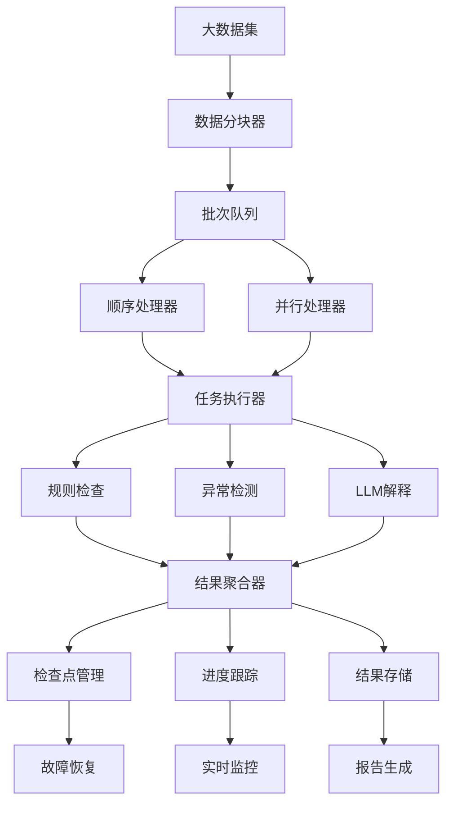

# S9: 批量账务审核功能

## 目标
优化批量数据处理逻辑（分块、并行），实现高效的大批量账务审核能力。

## 前置条件
- 完成 S8 数据持久化实现
- 了解并发编程概念
- 熟悉性能优化技术

## 核心架构设计

### 1. 批量处理架构

#### 1.1 系统架构图


#### 1.2 核心组件设计
- **BatchProcessor**: 批量处理器主类
- **BatchConfig**: 批量处理配置
- **BatchProgress**: 进度跟踪对象
- **BatchResultAggregator**: 结果聚合器

## 详细实现

### 1. 批量处理配置

#### 1.1 BatchConfig 类设计

```python
@dataclass
class BatchConfig:
    """批量处理配置"""
    batch_size: int = 1000                    # 批次大小
    max_workers: int = 4                      # 最大工作线程数
    use_multiprocessing: bool = False          # 是否使用多进程
    enable_progress_tracking: bool = True     # 是否启用进度跟踪
    enable_checkpoint: bool = True            # 是否启用检查点
    checkpoint_interval: int = 10             # 检查点间隔（批次）
    output_dir: str = "batch_results"         # 输出目录
    save_intermediate_results: bool = True    # 是否保存中间结果
    memory_limit_mb: int = 1024               # 内存限制（MB）
    timeout_per_batch: int = 300              # 每批次超时时间（秒）
```

### 2. 进度跟踪系统

#### 2.1 BatchProgress 类设计

```python
@dataclass
class BatchProgress:
    """批量处理进度"""
    task_id: str
    total_records: int
    processed_records: int = 0
    failed_records: int = 0
    start_time: datetime = field(default_factory=datetime.now)
    end_time: Optional[datetime] = None
    current_batch: int = 0
    total_batches: int = 0
    status: str = "running"
    error_message: Optional[str] = None
    processing_rate: float = 0.0
    
    def update_progress(self, processed: int, failed: int = 0):
        """更新进度"""
        self.processed_records += processed
        self.failed_records += failed
        elapsed = (datetime.now() - self.start_time).total_seconds()
        self.processing_rate = self.processed_records / max(1, elapsed)
        
    def get_progress_percentage(self) -> float:
        """获取进度百分比"""
        return (self.processed_records / self.total_records) * 100 if self.total_records > 0 else 0
```

### 3. 批量处理引擎

#### 3.1 顺序批量处理

```python
def process_batch_sequential(self, data: pd.DataFrame, tasks: List[str]) -> Dict[str, Any]:
    """顺序批量处理"""
    logger.info(f"开始顺序批量处理，总记录数: {len(data)}")
    
    # 初始化进度
    self.progress = BatchProgress(
        task_id=f"batch_{datetime.now().strftime('%Y%m%d_%H%M%S')}",
        total_records=len(data),
        total_batches=(len(data) + self.config.batch_size - 1) // self.config.batch_size
    )
    
    all_results = []
    failed_batches = []
    
    try:
        for batch_id, batch_data in self._create_batches(data):
            self.progress.current_batch = batch_id + 1
            self._notify_progress()
            
            # 检查检查点
            batch_result = self._load_checkpoint(batch_id)
            if batch_result:
                logger.info(f"从检查点加载批次 {batch_id}")
            else:
                # 处理批次
                batch_result = self._process_batch(batch_id, batch_data, tasks)
                
                # 保存检查点
                if batch_id % self.config.checkpoint_interval == 0:
                    self._save_checkpoint(batch_id, batch_result)
            
            # 保存结果和更新进度
            self._save_batch_result(batch_id, batch_result)
            all_results.append(batch_result)
            
            if batch_result.get("status") == "error":
                failed_count = batch_result.get("records_count", 0)
                self.progress.update_progress(0, failed_count)
                failed_batches.append(batch_id)
            else:
                self.progress.update_progress(batch_result.get("records_count", 0))
                
    except Exception as e:
        self.progress.status = "failed"
        self.progress.error_message = str(e)
        raise
        
    finally:
        self.progress.end_time = datetime.now()
        self.progress.status = "completed" if not failed_batches else "completed_with_errors"
        self._notify_progress()
        
    return {
        "task_id": self.progress.task_id,
        "total_records": len(data),
        "processed_records": self.progress.processed_records,
        "failed_records": self.progress.failed_records,
        "failed_batches": failed_batches,
        "total_batches": self.progress.total_batches,
        "processing_time": (self.progress.end_time - self.progress.start_time).total_seconds(),
        "results": all_results
    }
```

#### 3.2 并行批量处理

```python
def process_batch_parallel(self, data: pd.DataFrame, tasks: List[str]) -> Dict[str, Any]:
    """并行批量处理"""
    logger.info(f"开始并行批量处理，总记录数: {len(data)}, 工作线程数: {self.config.max_workers}")
    
    # 准备批次数据
    batches = list(self._create_batches(data))
    all_results = []
    failed_batches = []
    progress_lock = threading.Lock()
    
    def process_batch_worker(batch_info):
        """工作线程函数"""
        batch_id, batch_data = batch_info
        
        try:
            # 检查检查点
            batch_result = self._load_checkpoint(batch_id)
            if batch_result:
                return batch_id, batch_result
                
            # 处理批次
            batch_result = self._process_batch(batch_id, batch_data, tasks)
            
            # 保存检查点和结果
            if batch_id % self.config.checkpoint_interval == 0:
                self._save_checkpoint(batch_id, batch_result)
            self._save_batch_result(batch_id, batch_result)
            
            return batch_id, batch_result
            
        except Exception as e:
            logger.error(f"并行处理批次 {batch_id} 失败: {e}")
            error_result = {
                "batch_id": batch_id,
                "status": "error",
                "error": str(e),
                "records_count": len(batch_data) if batch_data is not None else 0
            }
            return batch_id, error_result
            
    # 选择执行器类型
    executor_class = ProcessPoolExecutor if self.config.use_multiprocessing else ThreadPoolExecutor
    
    with executor_class(max_workers=self.config.max_workers) as executor:
        # 提交任务
        future_to_batch = {
            executor.submit(process_batch_worker, batch_info): batch_info[0]
            for batch_info in batches
        }
        
        # 收集结果
        for future in as_completed(future_to_batch, timeout=self.config.timeout_per_batch):
            batch_id = future_to_batch[future]
            
            try:
                result_batch_id, batch_result = future.result()
                all_results.append(batch_result)
                
                # 更新进度
                with progress_lock:
                    if batch_result.get("status") == "error":
                        failed_count = batch_result.get("records_count", 0)
                        self.progress.update_progress(0, failed_count)
                        failed_batches.append(batch_id)
                    else:
                        self.progress.update_progress(batch_result.get("records_count", 0))
                        
                    self.progress.current_batch = len(all_results)
                    self._notify_progress()
                    
            except Exception as e:
                logger.error(f"获取批次 {batch_id} 结果失败: {e}")
                failed_batches.append(batch_id)
                
    # 完成处理
    self.progress.end_time = datetime.now()
    self.progress.status = "completed" if not failed_batches else "completed_with_errors"
    self._notify_progress()
    
    return {
        "task_id": self.progress.task_id,
        "total_records": len(data),
        "processed_records": self.progress.processed_records,
        "failed_records": self.progress.failed_records,
        "failed_batches": failed_batches,
        "total_batches": self.progress.total_batches,
        "processing_time": (self.progress.end_time - self.progress.start_time).total_seconds(),
        "results": all_results
    }
```

## 使用示例

### 1. 基础批量处理

```python
from agents.batch_processor import BatchProcessor, BatchConfig
from agents.accounting_agent import AccountingAgent

# 创建智能体
agent = AccountingAgent()
agent.register_skill("rule_check", rule_check_skill)
agent.register_skill("anomaly_detect", anomaly_detect_skill)

# 创建批量处理器
config = BatchConfig(
    batch_size=500,
    max_workers=4,
    enable_checkpoint=True,
    save_intermediate_results=True
)

processor = BatchProcessor(agent, config)

# 添加进度回调
def progress_callback(progress):
    print(f"进度: {progress.get_progress_percentage():.1f}% "
          f"({progress.processed_records}/{progress.total_records}) "
          f"速率: {progress.processing_rate:.1f} 记录/秒")

processor.add_progress_callback(progress_callback)

# 执行批量处理
data = parse_account_data("large_account_data.xlsx")
result = processor.process_batch_sequential(data, ["rule_check", "anomaly_detect"])

print(f"处理完成: {result['processed_records']} 条记录")
print(f"失败记录: {result['failed_records']} 条")
print(f"处理时间: {result['processing_time']:.2f} 秒")
```

### 2. 便捷函数使用

```python
from agents.batch_processor import process_large_dataset

# 一键处理大数据集
result = process_large_dataset(
    file_path="very_large_data.xlsx",
    tasks=["rule_check", "anomaly_detect", "llm_explain"],
    batch_size=2000,
    max_workers=6,
    use_multiprocessing=True,
    output_dir="results"
)

print(f"处理结果: {result['processing_result']['task_id']}")
print(f"聚合结果: {result['aggregated_result']['summary']}")
print(f"报告路径: {result['report_path']}")
```

## 性能优化

### 1. 内存优化

```python
def optimize_memory_usage(data: pd.DataFrame, config: BatchConfig) -> BatchConfig:
    """优化内存使用"""
    # 计算内存使用
    memory_usage = data.memory_usage(deep=True).sum() / 1024 / 1024  # MB
    
    # 调整批次大小
    if memory_usage > config.memory_limit_mb * 0.5:
        new_batch_size = max(100, config.batch_size // 2)
        config.batch_size = new_batch_size
        logger.info(f"调整批次大小为 {new_batch_size} 以优化内存使用")
        
    return config
```

### 2. I/O优化

```python
def optimize_io_operations(data: pd.DataFrame) -> pd.DataFrame:
    """优化I/O操作"""
    # 优化数据类型
    for col in data.select_dtypes(include=['object']).columns:
        if data[col].nunique() / len(data) < 0.5:  # 低基数列
            data[col] = data[col].astype('category')
            
    # 优化数值类型
    for col in data.select_dtypes(include=['int64']).columns:
        if data[col].min() >= 0 and data[col].max() < 255:
            data[col] = data[col].astype('uint8')
        elif data[col].min() >= -128 and data[col].max() < 127:
            data[col] = data[col].astype('int8')
            
    return data
```

## 常见问题

### Q1: 如何选择合适的批次大小？
**解决方案**: 
- 根据可用内存和数据复杂度调整
- 通常1000-5000条记录/批次比较合适
- 通过性能测试确定最优值

### Q2: 何时使用多进程 vs 多线程？
**解决方案**: 
- CPU密集型任务使用多进程
- I/O密集型任务使用多线程
- 考虑内存开销和进程启动成本

### Q3: 如何处理内存不足问题？
**解决方案**: 
- 减少批次大小
- 使用数据流式处理
- 启用检查点机制

## 下一步
完成批量处理后，继续进行 **S10: 审核报告自动生成**，实现标准化的审核报告输出功能。
